+++
title = "England"
date = "2017-05-22T18:00:00+08:00"
publishdate = "2018-02-27"
trip_date = "2017-05-22"
author = "Vicki"
featured_image = "/post/england/images/600x600_DSC_0804.jpg"
categories = [ "journal" ]
countries = [ "UK", "England" ]
tags = [ "castles" ]
series = [ "United Kingdom" ]
+++

England is GREEN and full of sheep and castles! <!--more-->

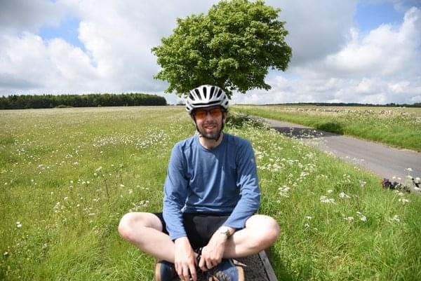

We rode 200+ miles from Heathrow to Bristol, with some beautiful
detours: Oxford, Cotswold, and Bath.

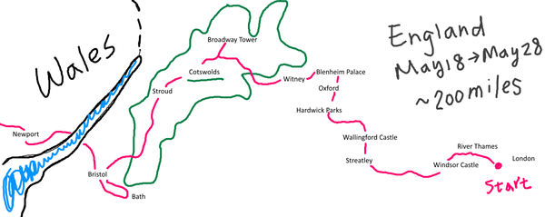

## Highlights:

### Wallingford Castle
Gorgeous old castle that had no tourists. Even the locals had
forgotten about it. I liked it a lot. We played around with the camera
and made friends with some very smart crows.

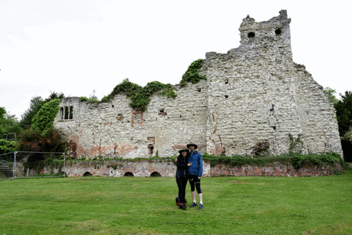

### First time cooking with our camp stove

We stopped at a gas station to get some gas for cooking. What happened
next was probably the most dangerous moment of our trip. Andrew was
trying to fill our bottle with gas, but he underestimated the pressure
of the pump. So the gas shot right out of the bottle and splashed all
over us. I screamed and ran away. We both felt like we died a little
that day. Luckily it was pouring rain, so we were able to wash a bit
off riding home.

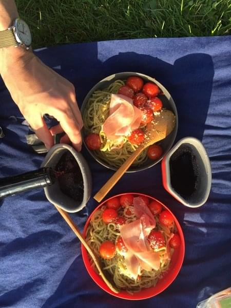

### Oxford
We enjoyed the park and watching the young souls paddling along river
Thames. We also did some pub crawling and looked for the drunk one
(gargoyles). Why didn't I go to oxford for college…

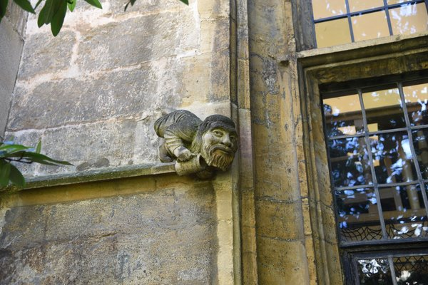

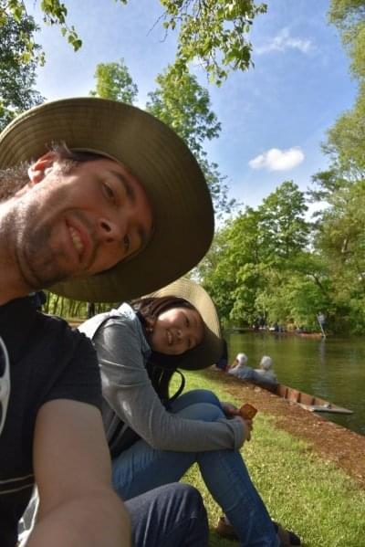

### Blenheim Palace
I probably should have done some homework before visiting. I heard of
Winston Churchill, but forgot exactly what he did. Blenheim Palace is
his birth place and home. We had a great time pretending to own the
place.

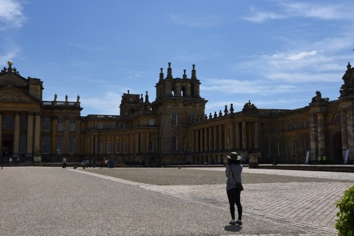

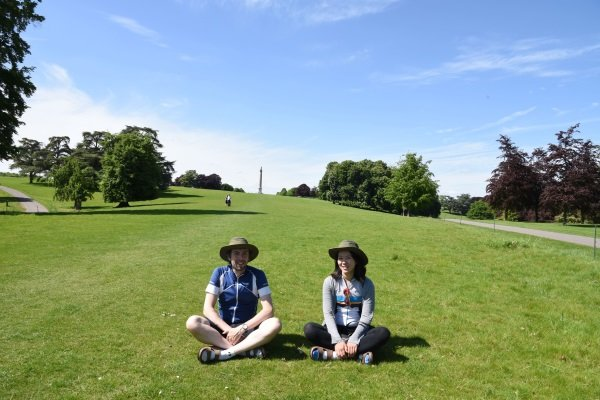

### Cotswolds AONB (area of outstanding natural beauty)
I think going here is a must for England. The small hills were full of
cow parsley (white flowers) and sheep. The villages looked like they
were from a fairy tale. It was beautiful! We camped a few nights and
had a wonderful time. We would walk through a farm to a bar called the
halfway house from our camp. It was a bit far but they had the best
sticky toffee pudding in the world! During our little night walk, we
thought we were going to get attacked by the sheep. They were all
sleeping in the middle of the road, and we walked straight into them.
Turns out sheep are harmless, so we were okay. Andrew was absolutely
terrified by the way… Some of the hills were tough to ride over, but
that's what makes the beer taste better.

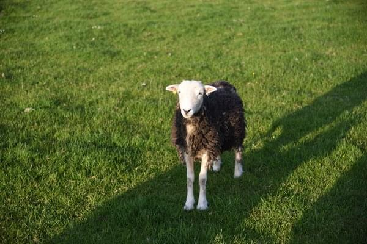

### Broadway Tower
It's north in Cotswolds. And it is the cutest tower I have ever seen.
I loved the view and it goes well with ice cream.

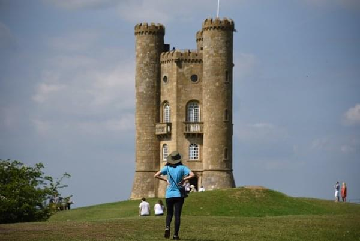

### Bath
We did a one day trip from Bristol to Bath. The whole way was on a
bike path and only 17 miles. We had a pleasant ride in the shades and
then got to see some 5000+ year old bath built by the Romans.

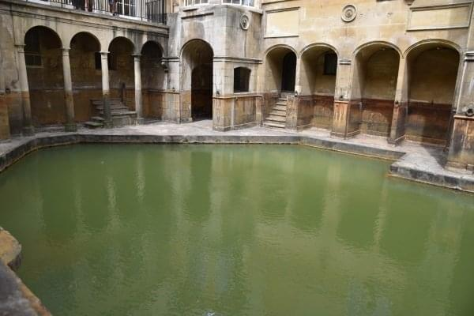

### Bristol
Of all the places we visited in England, Bristol is the most unlike
the rest of England. It's a rebel city (okay it was just dirty). I
liked the graffiti and the dangerous vibe.

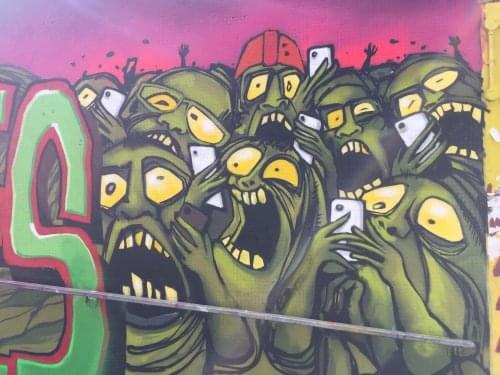