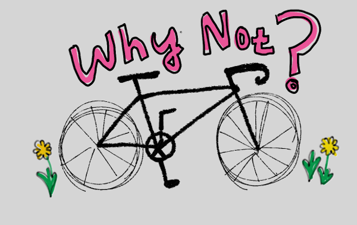
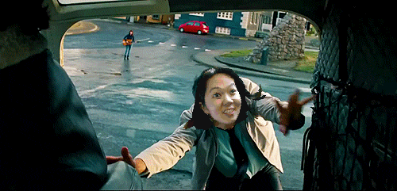

+++
date = "2017-05-04T20:01:16-07:00"
title = "How I decided to quit my job and go travel"
author = "Vicki"
featured_image = "/post/how-i-decided/images/vicki-mitty.gif"
publishDate = "2018-02-20"
categories = [ "how-to", "vicki talking to herself" ]
+++

It's all because of the song space oddity and Walter Mitty jumping on
to the helicopter.<!--more-->



I love this scene. It is so easy and so hard at the same time to take
a leap of faith and jump right on to a figurative helicopter. 

All the emotions: the fear of letting go on the things you have
(steady job, my air-plants, designer mugs, and Andrew's cat etc.), the
excitement of taking off and embracing the unknown, and the courage to
not settle, and live the life you dreamed of. 

So hey, I think I would enjoy spending some time seeing the world and
doing absolutely nothing!

### Here's me jumping on to a helicopter like Walter Mitty.

