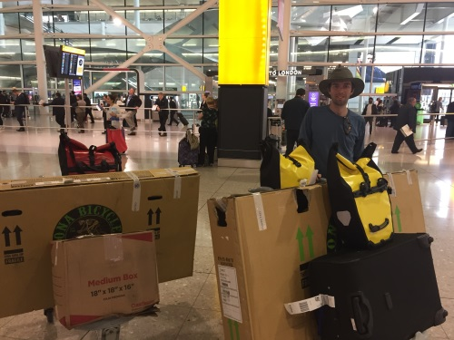
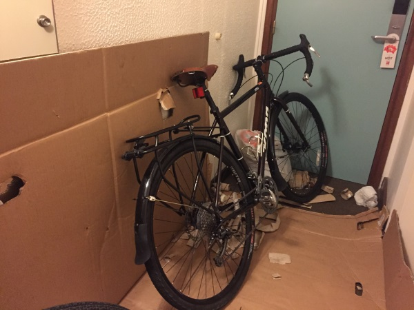
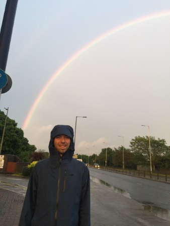

+++
date = "2017-05-17T20:01:16-07:00"
title = "How we left our stuff and took off from Seattle to England"
author = "Vicki"
featured_image = "/post/how-we-left-our/images/seeya.jpg"
publishDate = "2018-02-20"
trip_date = "2017-05-17"
+++

Once you made up your mind on traveling, the rest is easy. <!--more-->

First you need to decide on wether you're going to sell all your stuff
or store all your stuff. We decided to rent a storage room in Seattle.
We have some personal belongings that we believe were non-replaceable
(at that time). We gave ourselves one good week to move our boxes to
the storage room. It sounded pretty doable when we thought we could
borrow a truck from the storage unit. Turns out you need car
insurance, and we had just canceled it for the trip. 

But there's always a way, luckily we were smart enough to rent a unit
within walking distance. We carried everything from our apartment to
the storage room with a two-wheel dolly. It took us multiple trips,
everyday until the morning of our flight. We were stilling running
around and tidying things when the van driver called to take us to the
airport. We didn't finish clearing out our apartment … To sum it up,
it felt like we owe some gangsters money and had to run away and pack
our valuables in one night. 

A picture of us after pulling an all-nighter packing - dead but happy.

We were relieved once we were at the airport, since nothing more can
be done for the apartment we moved out of. We flew from Seattle to
Heathrow airport in England. The plane ride was like every plane ride,
except no food was served on Iceland air … But I was super happy that
our luggage (a cardboard box) made it to Heathrow airport. It was soaked
and barely holding our stuff together. 

We took our luggage and bikes to the hotel on the airport shuttle bus;
ate some Indian curry (chicken masala) for dinner; saw a rainbow;
assembled our bikes in our room; made a mess in our room; slept for a
bit; then woohoo we were so ready! 

