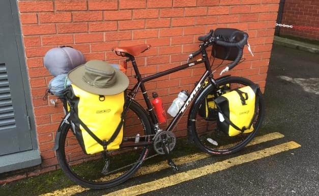
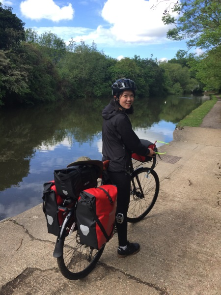
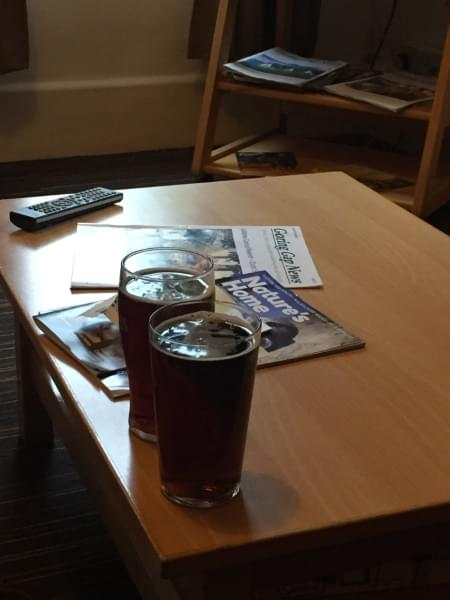

+++
date = "2017-05-18T20:01:16-07:00"
title = "The very first day on our bikes"
author = "Vicki"
featured_image = "/post/the-very-first-day/images/IMG_0069.jpg"
publishdate = "2018-02-24"
trip_date = "2017-05-18"
+++

After packing everything in our bike bags, eating with the Chinese tourists, and practicing riding our bikes in the hotel parking lot - we were ready!
<!--more--> 

Andrew rode ahead and I followed behind, he was wobbling like crazy when cars were rushing by us. And I thought is this really going to work? 

We planned to ride 40 miles from Heathrow airport to Streatley (a small town west of London near Reading).  It started alright, ugly roads to ride out the airport area. Then it got a bit pretty along River Thames, but it started to rain (it's England, what do you expect…) and we had to ride on gravels for 10 miles along the river. It was a bit frustrating since we were going very slow and getting hungry.

But a bad road can't go forever, soon a pretty park (Upton Court Park) with swings magically showed up. We played on the swings and wondered why we didn't do this more often. Soon it was past lunch time and as Andrew always says - "we got to put on some miles" (later on this became a taboo to say for a while for me). We continued our ride. 

Initially, I thought we could just stop by Windsor castle casually. But there was a long line to enter the castle and we were running out of time. Also the hostel we booked was non-refundable, so there wasn't really an option to stop earlier. 

So we didn't go to Windsor castle (heard it's one of Britain's best castles). Oh well…

We then stopped for lunch at a fancy place since we were dying at 2 and it  was the only option (but hey all places in England look fancy). After lunch we felt pumped again and was able to ride the remaining 25 miles to our hostel. The last few miles had a little climb. It was hard, but we made it sort of before dark and I was very happy that I had a great first day riding in England! 

