+++
date = "2017-06-03T18:56:40-08:00"
title = "Wales"
author = "Vicki"
featured_image = "/post/wales/images/DSC_1262.NEF.jpg"
publishdate = "2018-03-06"
trip_date = "2017-06-03"
+++

People in Wales speak Welsh. After leaving Bristol and crossing River Severn, we were in Wales! <!--more-->

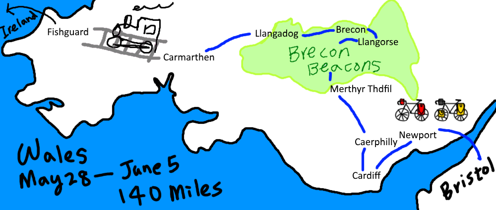

The first thing I noticed was the distinctive Welsh language. I find it funny and friendly. The medieval castles were mysterious and spiritual (dead souls). I like it. 

## Highlights:

### Newport Severn Bridge

It was the very first time we got soaking wet. (days like that became more common in Ireland and Scotland…) It was still enjoyable, because who doesn't like riding over a tall bridge and seeing the fast water beneath. 

We also spent my birthday at an Indian restaurant in Newport (only one month in UK and we got tired of British food?)

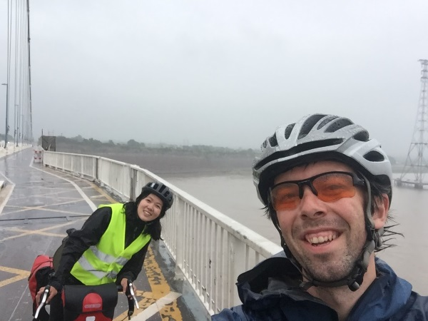

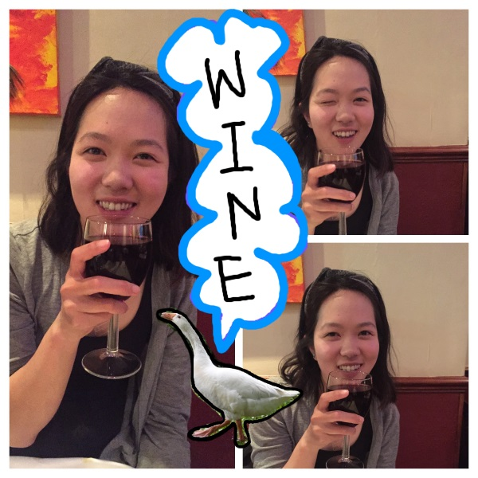

### Cardiff Castle

Heard it's one of the best medieval castle to visit if you are in Wales. We enjoyed the outside of it and had a Nata. 

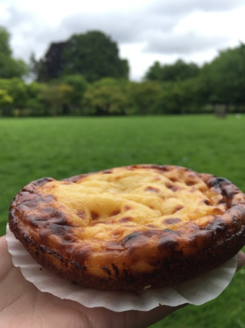
### Caerphilly Castle 

Caerphilly Castle is 10 miles north of Cardiff. The castle is surrounded by water. We played with some duck? And wondered around the haunted castle - where the King killed his wife's lover. Legend says that the green lady (she was wearing a green dress when she died of sorrow) has been haunting the castle ever since. 

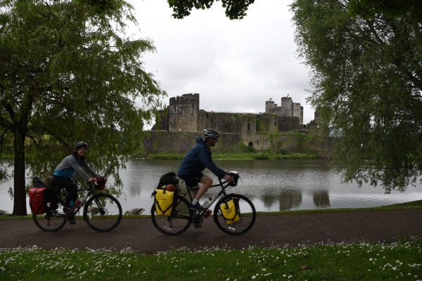

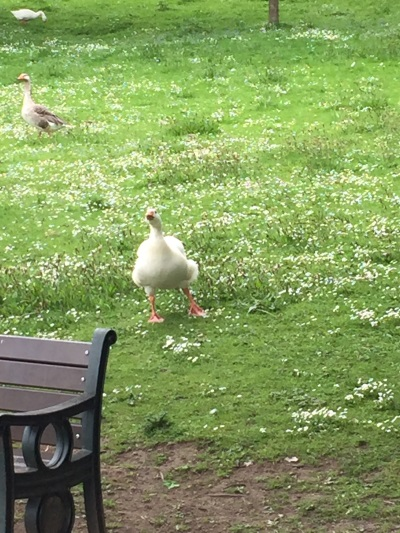
### Brecon Beacons

We stayed at a camp site near Merthyr Thdfil, a big town before getting into the hills of Brecon Beacons. The ride up the mountains (or a very big hill) was stunning! It was hard but very rewarding at the top. 

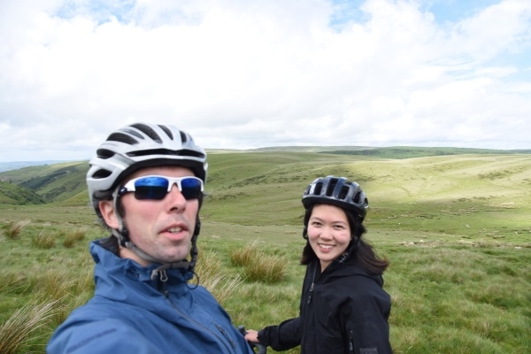
### Llanfrynach 

After a long day riding in the mountains. We arrived at a tiny town called Llanfrynach with only one single restaurant (The White Swan Inn). The view from our Airbnb was amazing! And I loved the tiny rebel beer.

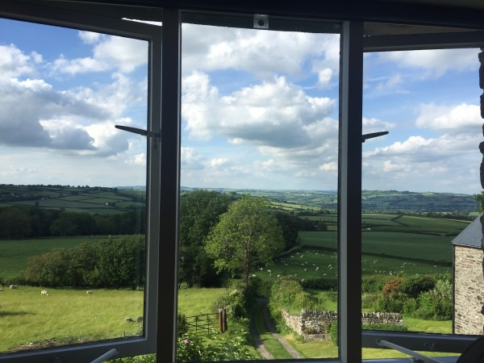

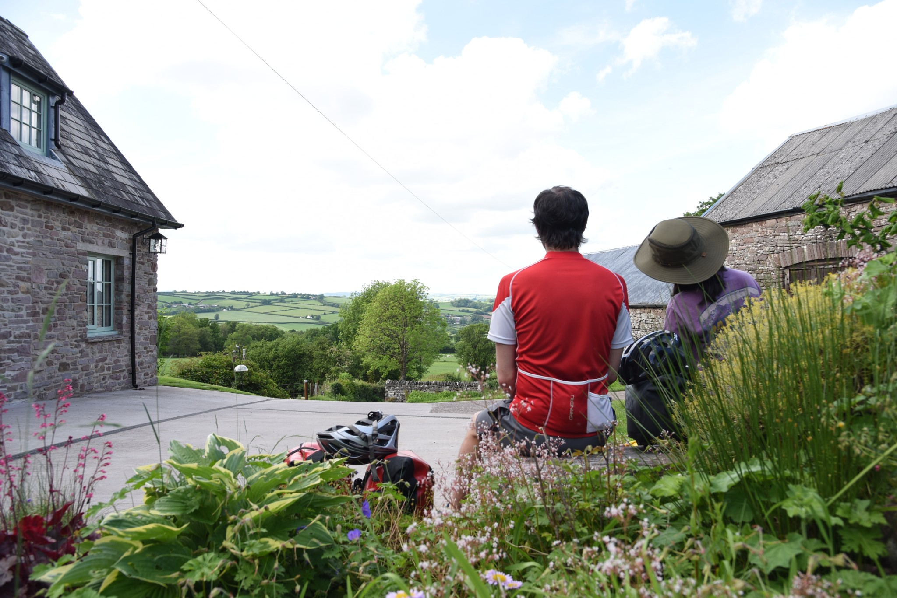

### Llangadog

After Brecon, we kept riding west. Llangadog is just a little outside of the Brecon Beacons national park. When we arrived, we had to ask three inns before finding a free room to stay. Turns out there was a tracker parade. We had a blast and enjoyed the small town vive. 

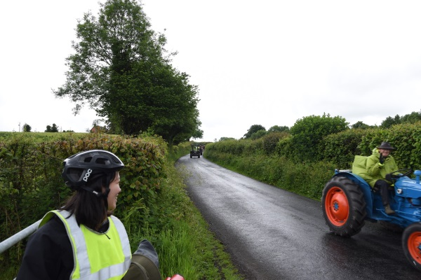

### Other Things

Andrew was hoping to see this and he did. 

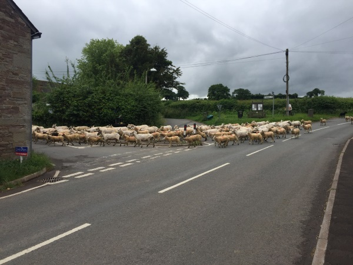

hmmm...

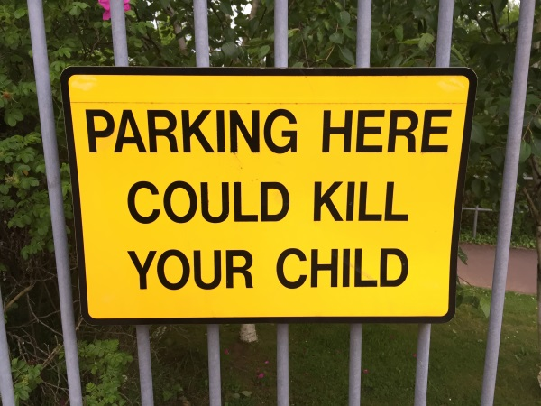