+++
title = "A Lap Around Scotland with My Mom"
date = 2018-04-03T15:07:07+12:00
author = "Andrew O'Neill"
publishDate = 2018-04-17
trip_date = 2017-06-27
featured_image = ""
categories = ["journal"]
countries = ["scotland", "uk"]
series = ["uk", "a lap around scotland with my mom"]
tags = []
draft = true
+++

While we were traveling in England, we convinced my Mom, Wende, that she
had to join us. We were having too much fun to miss out on.  Actually,
it didn't take much convincing. Anyway, Wende and Dan decided they would
join us for a bike adventure. <!--more-->

## Getting To Glasgow

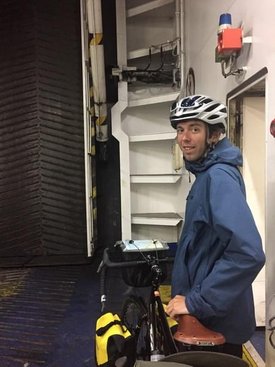

For us that set a deadline for our trip in Ireland. We now had somewhere
we actually needed to be at a certain time. Fortunately we planned ahead
enough to arrive in Scotland at the same time. We just didn't know what
would happen on our way.

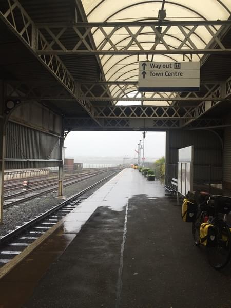

We woke up early on the June 27th to catch a ferry from Belfast to
Cairnryan. The ferry was a little farther than expected and took us longer
than we planned to get there. I started to freak out a little about being
late and not meeting my Mom (who didn't have any way to contact us). On
the last half mile of the road to the ferry my tire was punctured for
the hundredth time. I sent Vicki ahead to secure our spots on the ferry
and hopefully hold them for long enough for me to make it. While running
down the road pushing my 80 pound bike I missed the sign for cars to
turn and accidentally went down the road for trucks. When I got to the
station the security guard was very confused. I told her about the flat
tire and she said that the way to the ferry for pedestrians was back a
bit. I asked if she'd help me lift my bike over the guardrail so I could
cut straight to the terminal. She agreed and then was shocked when she
realized how heavy my bike actually was. After jumping the rail I saw
Vicki and pushed the bike over to the terminal.

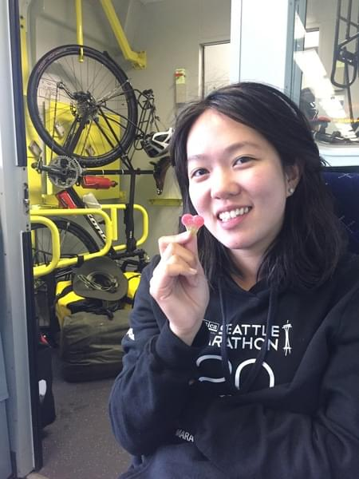

We also hadn't realized that getting the bikes on the ferry would require
a ton of paperwork. Much more than when we went to Ireland at least. After
filling out a bunch of forms and paying all the fees we rolled our bikes
on the ferry and locked them in a crew room in the lower area. I got a
bunch of stares for pushing my bike.

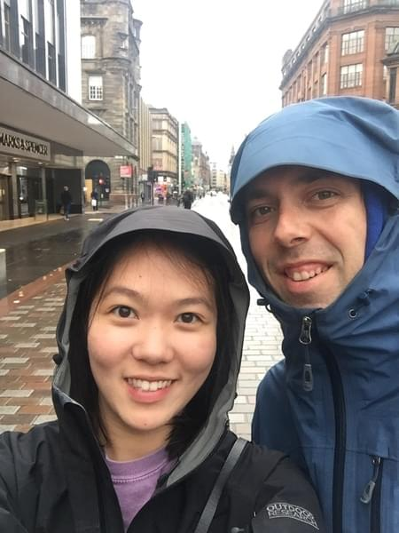

The ferry ride was much more pleasant than our previous one. No one felt
any sea sickness and we got there pretty quick as well. After arriving,
we set to fixing the puncture. Then we rode south to Stranraer (the
opposite direction of Glasgow). Of course it was pouring rain and we were
completely soaked. We rode first to the train station to center ourselves,
then went off to find something to eat and warm us up. We settled on a
tea shop and stripped off our wet jackets and had some tea and scones.
It was so nice to sit somewhere dry, but I'm sure the shop wasn't happy
with the puddles we were creating on the floor.  When it was time to go
we headed back to the train station and bought some tickets to Glasgow.

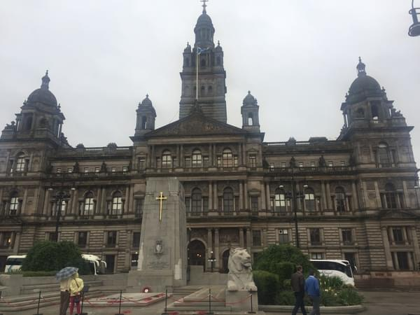

When we got to Glasgow we set off for the Hotel/Apartment. We were really
excited to meet up with my mom. When we arrived at the apartment it was
empty. There were no signs of Wende or Dan anywhere. We had no idea
where they were since we could not contact them. We went back to the
reception to check if they arrived and he said there was a note for us.
It said Wende and Dan had gone to pick up their bikes and they'd meet us
at the apartment later. We took a short walk around the city then went
back and waited until they were back. It was so nice to see them. The
last time we saw them we were dropping off Oscar and preparing for the
journey. We decided to go out for a good dinner to prepare us for the
upcoming challenge of biking around Scotland.

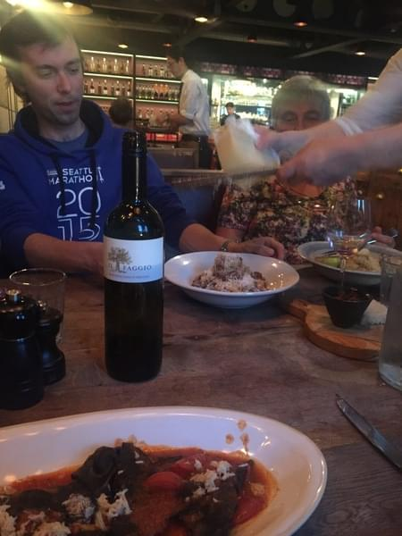

We went to a restaurant started by Jamie Oliver or some famous TV
chef. The food, wine, and company made it an excellent night. After dinner
we walked back to the apartment. Vicki and I were exhausted from our long
day of biking and travelling. Wende and Dan were not tired at all. The
jet lag and excitement from being somewhere new must have given them
some energy because they decided to go out and hit the town. From what I
remember they said they went to a small casino and had a few whiskies. I'm
not sure what time they got back because we were fast asleep.

# Glasgow to Aberfoyle

Now that we're all together we're off to the races. <!--more-->

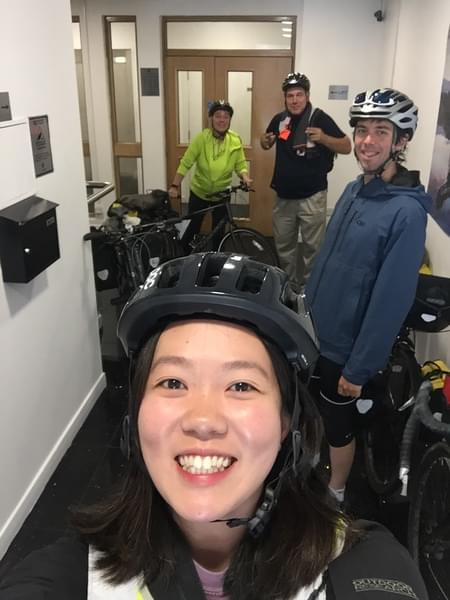
	
## First Day on the Road

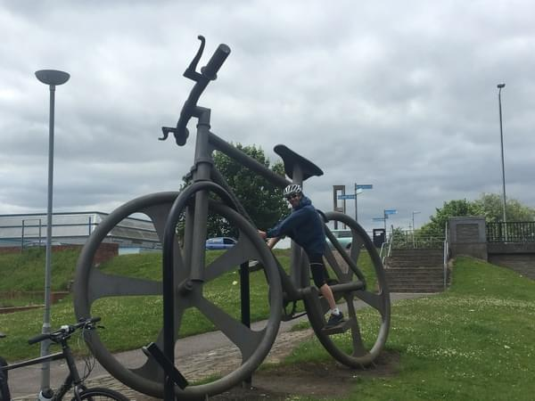

In the morning, we all got up, made some breakfast, checked out, and were
ready to hit the road. Wende and Dan had hired (rented in American) some
bikes from a local shop. They were basic road bikes with a rear rack for
panniers. We started by riding back to the shop so they could leave some
luggage. I also bought them some water bottles and got some more spare
tubes. Then we headed northwest toward the first destination, Balloch.

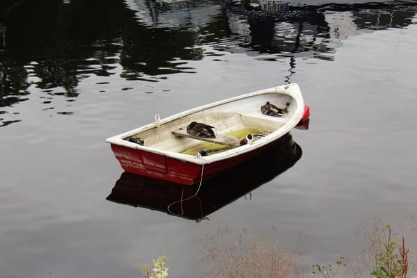

We hadn't really made any plans. Wende had made a reservation at Pitlochry
so we chose a route that would get us there. After cycling through England,
Vicki and I were pretty familiar with the national cycle routes. We
chose to follow route 7 from Glasgow all the way to Inverness. The
first day was pretty easy. A walk in the park for Vicki, Wende, and I.
Dan (non-biker) seemed unphased as well. The ride out of Glasgow
was not that exciting, pretty urban. We took a small break for lunch at
a little coffee shop. The rest of the ride was nicer. The route moved
away from the urban areas and got out into the woods. We arrived in
Balloch between 3-4PM. We attempted to stay at a campsite. The
only one in town did not allow tents though. We ended up staying at
an inn on the main road.

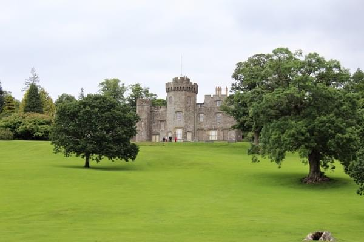

Wende and Dan went out for a walk around the area. They took some
pictures of the lake and castle. Vicki and I watched tv and drank a
beer. Later we all had dinner at the restaurant downstairs.  After a
good meal we all went back to our rooms and agreed to get up early,
around 8AM, to start our next leg of the trip.

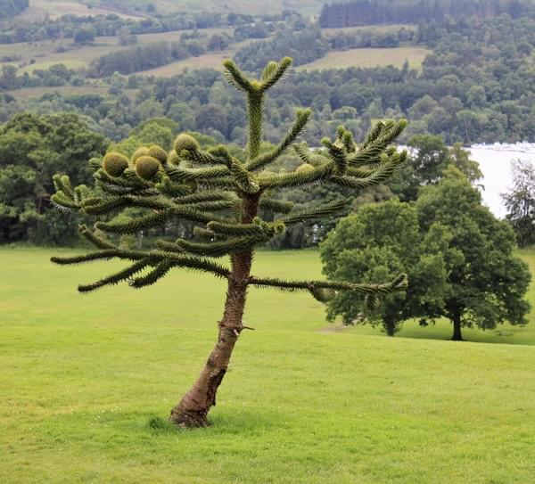

## Riding in the Rain

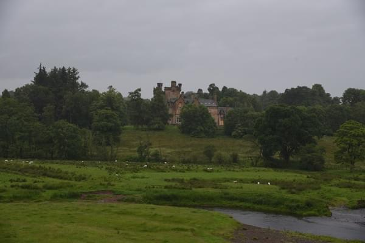

When we got up the sky was not looking very happy. We rode down the street
to the grocery store to get some food for our ride. After stocking up
on energy bars, and dried fruit we left for Aberfoyle.

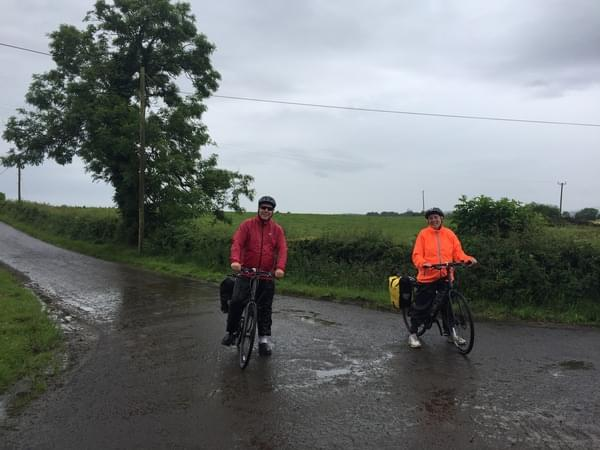

We continued along route 7 and encountered our first few hills of the
trip. Vicki and I were accustomed to the weight of the bikes and the
effort needed to ride over a hill. Dan and Wende had not experienced
this yet and for them it was really tough. On the steeper sections both
of them would get caught in the wrong gear or already _red lining_. We
later got in the habit of calling out hidden hills or steep inclines,
which Vicki and I would sometimes do lovingly later on. This day was
really tough.  After about an hour of overcast skies the rain came in full
force. The rain drenched us and it was freezing cold. In a small town,
Dan bought some waterproof boots to cover his shoes while riding. Then
we had lunch at a pub.  We were all really cold and wet, but the tea and
meat pies warmed us up.  After a long lunch we continued on in the rain
for another few hours.  Finally arrived in Aberfoyle.

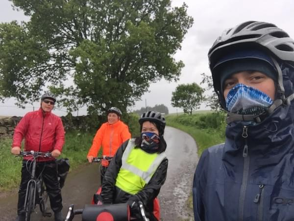

Since it was still early we went to a wool shop before trying to find
somewhere to stay. It turned out to just be a store for tourists. (I'm
not sure the wool was even from Scotland.) We left and went to find a
place to spend the night. For Vicki and I finding places to stay had
been relatively easy. We rarely booked places in advance very often and
found a room at the first place we asked. This was not true
when travelling with 4 people. The first place we tried only had one
room. Then Vicki asked at one inn while I asked at another. Both were
fully booked. We eventually went to the tourist info and asked them about
where to stay. They found a B&B for us and we were very relieved. Before
this I had never considered that we might not be able to find a place
to stay the night. I was really worried that we'd have to split up or
wild camp somewhere. Luckily it all worked out.

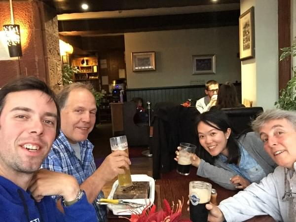

That night we went to a cool stone grill restaurant.  They would give
you a red-hot stone and a raw slab of beef or lamb. Then you cooked
the meat to your desired bloodiness. It was delicious, and then we got
to introduce Wende and Dan to Sticky Toffee Pudding. STP is the best
dessert _in the world_.  While paying the bill Dan somehow convinced
the waitress to let him keep a pint glass. It would become one of the
many glasses Dan would carry around Scotland and then home to Buffalo.

# Killin it

On this stage we ride up a mountain to a waterfall then around some
lakes. We relax with some live music. <!--more-->

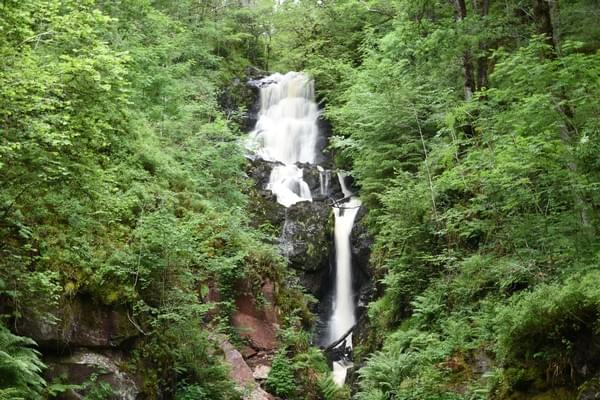

## A Tough Climb out of Aberfoyle

<video src="images/test.webm" loop autoplay muted>
<source src="images/test.webm" type="video/webm">
<source src="images/test.mp4" type="video/mp4">
Sorry, you can not play videos. Try chrome or firefox.
</video>

After a good night's sleep in Aberfoyle, we had a nice breakfast at the
B&B then headed off for our next destination, Strathyre. The first part
of the day was really tough. There was a long, steep hill right off the
bat. The path then switched from paved to dirt. The trail weaved through
the forest avoiding the highway. There were many pretty waterfalls and
lakes along the way. We stopped and took lots of pictures. The hills
and dirt trails began to wear us down.

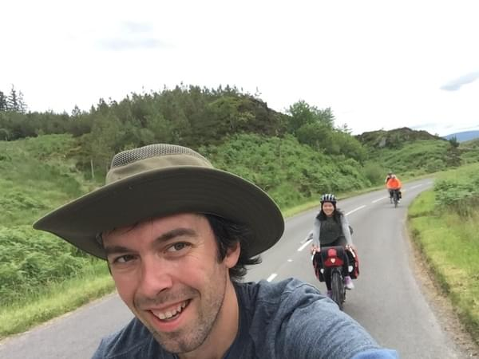

I decided we should take a shortcut. The shortcut lead us out
onto the highway (not what I was expecting) then back around to a
rest/viewing area. From there we rejoined the trail. It probably wasn't
a shortcut. Sorry Mom. At the bottom of the lake I thought we could do
a hike to get to an area of interest, but we soon lost interest since
it was a steep climb up slippery muddy slopes with no indication that
we were even going the right way. Trust in my navigation skills wasn't
at its highest.

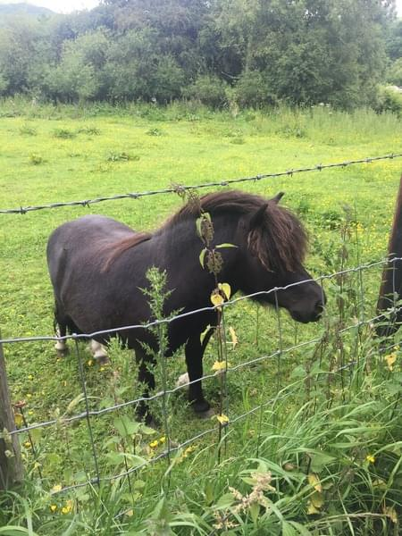

The route continued along a lake then joined a stream. When the path
opened up at the end of the lake, we stopped to take pictures of miniature
horses and the scenery. It seems like all the horses in Scotland were
miniature. We continued along the trail through a log cabin resort and
crossed a river eventually arriving in Strathyre. We decided to camp
since we had stayed in B&B's for the first few nights.

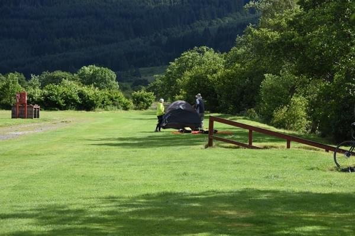

Vicki and I picked a spot and set up our tent. Wende and Dan set up
their tent near ours, decided that something was wrong with that spot:
it smelled of rotting grass, and then carried their tent 100 meters away
to a spot more suitable to them. We walked around the town, there wasn't
too much, a few inns and a pub. We went to the only restaurant that was
open and had some beers. The owner of the pub sat with us and offered
to drive us to one of her favorite places in Scotland. We couldn't take
her up on the offer because we were on a schedule to get to Pitlochry
(the reservations could not be cancelled). We later ended up having some
food as well. It was probably lamb and definitely had potatoes.

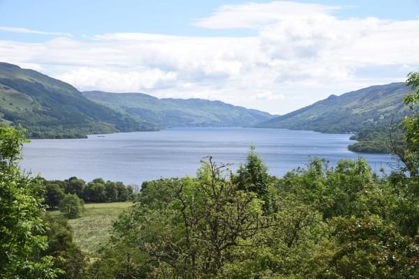

Camping was fine: surrounded by mountains next to a small stream. I
had suggested that Wende and Dan bring mats to sleep on and pillows. I
should have probably suggested to buy a 3 person tent but we hadn't even
discovered that for ourselves. Wende said they were very comfortable
and had slept like babies. Luckily it wasn't rainy and only a little
chilly. So we packed everything mostly dry and set off for Killin.

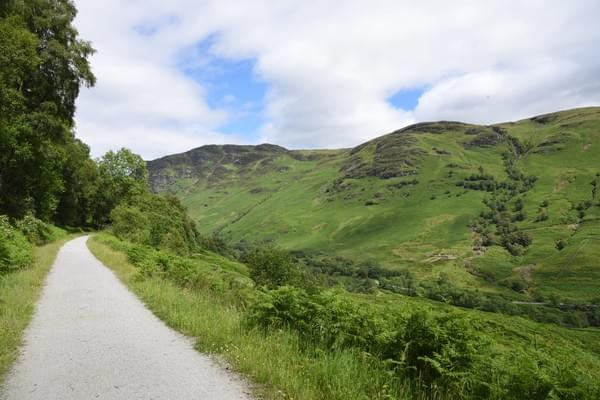

## Killin It

We saw a lot of bikers on the route to Killin. I think many were staying
at the campsite with us and were just doing a day trip. Killin was pretty
close only about 20 kilometers and was kind of a rest day for us after
the two long hill days. The route to Killin was pretty nice except for
the loose gravel coming down the killside into the town. Killin was a
cute little town along a river. The river flowed over some large rocks
and under a stone bridge. There was one pub at the end of the bridge
that we came from and across the bridge was the rest of the town. We
found an inn and took the last available rooms. They might have been
the last rooms in the whole town.

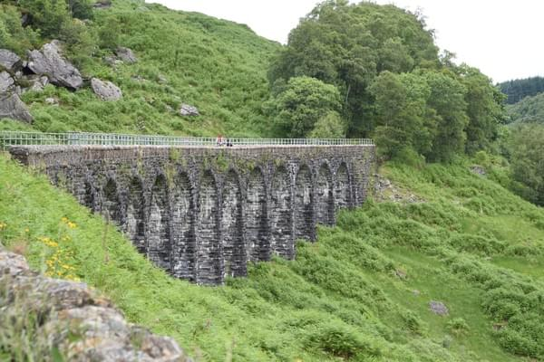

We wandered the town in the afternoon and did some shopping. Vicki and I
bought a bunch of postcards, Wende and Dan bought some sneakers: Wende's
were full of holes from riding in the rain. For some reason they both
wore their worst shoes, maybe they had intended on getting rid of them
the whole time. We made a reservation at the restaurant across from our
B&B. The dinner there was really good. Probably lamb and potatoes. After
dinner we walked back across the bridge to go to the pub where there
was a guitarist playing.

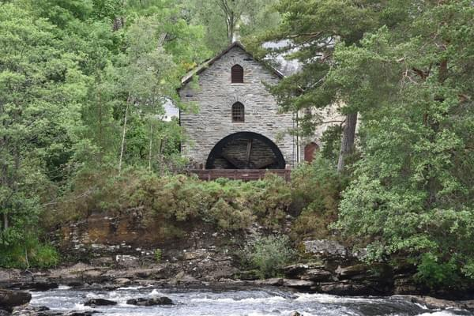

The guitarist was playing older rock songs. We were expecting something
like the Irish trad music. He took some requests. Eventually my mom got
tired and went back to the B&B. Vicki and I stayed even though we knew we
had a very long ride tomorrow. We got a few more drinks. An Irish/Romanian
couple sat with us and taught us how to drink Whiskey (the Irish way)
as well as the difference between Whisky and Whiskey.  Later a guy in
traditional scottish clothes showed up and everyone started dancing and
singing. It was a really fun night and we probably stayed way to late.
Surprisingly, the party was still going on after we left.

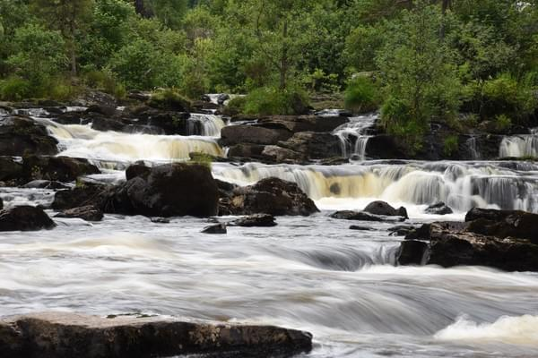

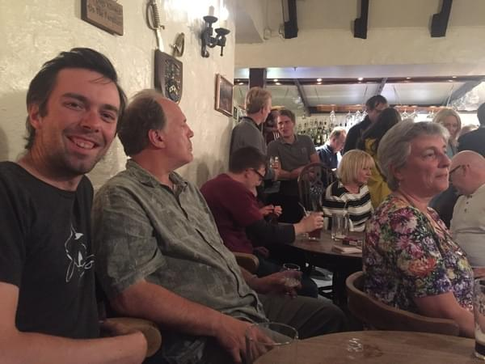

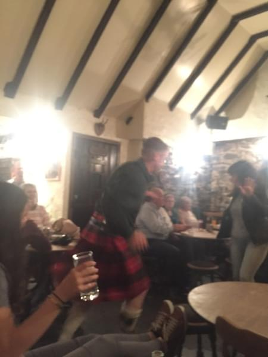

## Passing Through Dull

The next day we began the ride to Pitlochry. Since Wende had made a
non-refundable booking, we decided to push ourselves and make it to
Pitlochry. The first part of the route followed the lake to the east.
The road had lots of rolling hills so we weren't making significant
progress. Coming the opposite way of us seemed to be a classic car
parade. There were many old convertibles and coupes. After coming over
one of the hills I got a puncture. I told Vicki to catch my Mom and
Dan who were riding in front of us and tell them. I felt like it was
a Top Gear moment, when one of the hosts cars would undoubtedly break
down. Then they'd be left behind to deal with it themself. I patched
the tube and caught up. They had stopped at a shop a few miles ahead and
waited. We continued on to the end of Loch Tay where we stopped for some
lunch. After a quick bite we continued toward Pitlochry.

We passed through Dull, sister city to Boring, Oregon. We stopped
at Castle Menzies to use their restrooms and get an American History
lecture. Then rode through Aberfeldy without stopping at the distillery
(I can't believe it either). We finally arrived in Pitlochry right before
it started to get dark. As we rode through town it felt a little like a
ghost town. We expected much more people to be out and about. Since it
was around 5PM. Our hotel was in the back of town on a hill. We stored
our bikes and immediately went for the hot showers.

The man managing the hotel was really charming. He had some interesting
stories to tell as well. He was originally from Romania and apparently
lived or worked (I forget) near Count Dracula's Castle.  His accent and
the precision he chose his words with made Vicki and I wonder exactly
how close he was to Dracula's castle.

// TODO more on this

## A Day Without Baggage

The next day we ditched the bags and did some short rides to the nearby
destinations. First up was Blair Castle. The castle is really bright,
white color. There was a bagpiper that would play every 30 minutes
or so and march from one door end of the castle to the main door at
the center. The inside of the castle had tons of treasure and fancy
stuff you'd expect in a castle. The rooms I remember most clearly are
the entrance with all the guns, shields, swords, and spears, the room
with all the hunting trophies (where trophy means animal head), and the
ballroom where we put on funny costumes meant for children. We had some
tea in their cafe then went and explored the gardens. Vicki and I played
on some playground equipment before joining Wende and Dan in the Hercules
Garden. The garden is really beautiful. There was a swan family in the
lake and many interesting statues. After we had walked the gardens we
hit the road.

Our next destination was Edradour distillery. The route was back through
Pitlochry, which was buzzing, and then down the road past another
distillery. We then took a right and were greeted by a really long hill
up to the Edradour distillery. Vicki and I arrived first and ran in and
bought tickets for the last tour. Dan and Wende got there just in time
to start the tour. Edradour is special as it is the smallest traditional
distillery. Every barrel of whisky they made was unique. Unlike many
distilleries that do everything to maintain the same color and flavor,
Edradour prided itself on it's differences. We took a tour of the
distillery which included 2 whisky samplings and a whisky glass to take
home (another glass for Dan to carry). In their storehouse, we saw all
the barrels they were making as well as some other barrels that they
were collecting. One was worth a couple million. They kept it near the
door so if a fire broke out it would be the first barrel rescued. After
the store house they took us to their distillers and mashers and whisky
bean thingies. I'll need to have some Edradour to remember the names of
everything. Dan bought a bottle of their "Baileys".

We decided to try a different route back to our hotel which turned out
to be really nice (the whisky might have helped that opinion). It was
a long winding road that came from the backside of the town past farms
and right up to our hotel. Thankfully it was all downhill. At the hotel
we polished off Dan's recent purchase with our new whisky glasses then
went out to dinner. During our meal, a scottish marching band passed by
and everyone flooded the streets to watch. Since we didn't have too much
time left to travel and wanted to go the the Isle of Skye and the Harry
Potter train, we decided to take a train the next morning for Inverness.

## Training Day

Usually when I say morning I mean around 7-10AM. We got on the train
at 5:30AM and had to get ready at 4 so maybe it was still night or
pre-morning. The station was totally empty. It was also built before
accessibility was standard procedure. So in order to get our bikes to the
right side of the track we had to take off all our bags, carry them up
some stairs and over a bridge, then go back and carry all our bags. Not
fun at 5AM. The train conductor was really nice. He warned us of midges
and told us about his motorbike tour through America. I'm pretty sure
we were the only people crazy enough to ride the train this early.

In Inverness we got some breakfast at a cafe. The friendly waiter
told us the only solutions for America's recent mistake, impeachment
or assassination. After breakfast, we wandered around the city a bit,
then rode to a park. We were just killing time until we'd jump on another
train to Kyle of Lochalsh.

The train ride to Kyle of Lochalsh went through some incredible areas,
Scotland's highlands are truly beautiful. From Kyle of Lochalsh, we rode
across the Skye bridge to the Isle of Skye. We stayed at a campsite
in Ashaig. It was pretty minimal, but the site had a great view of
the water and mountains. This also happened to be our first encounter
with midges. Vicki and I had walked down to the water around sunset to
take some photos. On the way back, the wind suddenly stopped and the
Jaws theme started playing in my head. The sun was almost down and the
midges were swarming. We barely made it back to our campsite alive,
and wouldn't be able to truly assess the damage until the next morning.

## From Hogwarts to Braveheart

Vicki's face was covered in bites and my legs and arms were dotted as
well. It looked like we contracted chicken pox and itched the same
way. That day we decided to go to Eilean Donan: a very picturesque
castle at the intersection of three bodies of water. To get there we had
to catch the bus. So we walked to the bus stop. Just kidding, we just
waved down the first bus that passed and luckily it stopped. The castle
was really cool. So cool that it was featured in a James Bond movie,
and many other movies. We got there just before it opened so it hadn't
filled with tourists yet. We took a bunch of pictures and read about
the castles history. After we had fully explored Eilean Donan we caught
another bus back to our campsite. We packed up and got ready to ride on.

Our plan was to get to Mallaig and ride the "Harry Potter" train to
Fort Williams. So we rode south through the Isle of Skye on a scenic
country road. Of course my bike got another puncture. We met another
couple of bikers on the road. We got to Armadale with about an hour
to spare before the next ferry so we ate ice cream and shopped around.
When the ferry arrived we loaded our bikes and ordered some drinks. We
were in Mallaig sooner than I expected. Once there we found the train
station and reserved tickets for us and the bikes. Wende and Dan bought
some fish and chips while Vicki and I looked for an ATM and wifi,
hoping that we'd be able to book a hotel or inn after a long day. We
were unsuccessful on looking up accomodation but were not too worried
since Fort Williams seemed like a big town.

We didn't ride the coal or steam Harry Potter train we just rode a
normal metro-looking train. The ride was fun, everyone was anticipating
the moment of crossing the famous bridge from the Harry Potter movies. I
thought we'd blow through it at 100 miles per hour but the train stopped,
allowing us to take some photos. There were also dozens of people on
the hills nearby taking photos of us. When we arrived in Fort Williams
it was starting to get late.

We rode our bikes into town hoping to see an inn or hotel but eventually
gave up and rode 5Km or so to a campground. It turns out the campground
was at the base of the tallest hill in the UK. There were tons of
hikers and backpackers there that were doing the 8 hour climb to the
summit. The village from Braveheart was also filmed nearby. It was just
a coincidence that we ended up here but it turned out to be somewhere
interesting. Anyway we were camping again after another long day. Vicki
and I desperately needed to do our laundry. So we woke up early and
washed our clothes with a bunch of backpackers charging their phones and
drinking coffee. With our clothes clean and warm from the dryer we were
ready for another day of adventuring.

## Going Backwards to go Forwards

First, we went back to Fort Williams. We bought some of the maps of bike
routes and planned our next ride. We started following route 78 out of
Fort William and soon found ourselves at another ferry. This ferry was
much smaller. It looked more like a submarine on the inside.  We loaded
the bikes on top and carried all the bags. We met a young guy who was
about to start walking around Isle of Skye. Vicki and Wende couldn't
stop mentioning how handsome he was. There was also another younger
woman who was out for a run. Dan asked which direction we were headed
and I told him we were going North, which he realized was the opposite
direction we wanted to go. He wasn't too happy to learn we were taking
a longer route. When we arrived both pedestrians headed down the road
as we unloaded our bikes and packed the bags.

We quickly caught the backpacker and wished him a good journey. The
road was really pleasant with very few cars and excellent views of the
lake. Just before we arrived at the ferry we caught up to the woman who
was apparently not just out for a jog but an olympian of some kind. We
took a ferry back to the other side of the lake then had some lunch. After
lunch we continued to Glencoe.

We were determined to find somewhere indoors to sleep tonight. We could
tell Dan was hurting from the continuous days biking. We stopped at every
B&B and inn in the area hoping one could take us, but they only had room
for two. My mom didn't want to split up since we probably wouldn't see
each other again for a while and every moment to her was precious. So
we camped again.

## West to East

We were right on the shore of the lake. When we arrived a friendly German
woman offered us coffee and tea to warm up. We had a decent dinner and
bought some bread for breakfast the next morning. Wende and Dan were
packed and ready to go well before us. They ate breakfast where we had
dinner the night before. The German woman offered us coffee again but
we declined since Wende and Dan were waiting on us.  This night we had
promised to sleep in a bed, but first we needed to bike to Oban.

Getting to Oban was pleasant the route switched between the hills and
the water a few times. We bumped into a lot more people on bike tours.
Another awesome coincidence was seeing Castle Stalker. It kind of
just appeared out of the trees as we were passing by, but turned out
to be one of Vicki's favorite castles. We continued up some big hills
through farmland. Just when we were all getting pretty worn out in the
hills we came to a long descent. It was a really nice windy road that
was shaded by trees. Near the bottom of the descent I heard a gunshot.
My heart froze for a beat. Then the rim of my back wheel started running
on the gravel. This was the end of the tires life. It had worn through
to the threads. I used a US dollar to "patch" the tire and put in a
new tube. We rode for 20 seconds and then a cannon fired. I gave up and
decided to push my bike the rest of the way to Oban, which luckily was
not too far. I stopped at the closest bike store and bought a secondhand
tire. After swapping the tires we headed to the nearest pub.

Vicki and I found a place for us to stay in Edinburgh on Airbnb so we
relaxed in Oban and waited for a train to Edinburgh. I think we ate two
meals at the pub. Dan and Wende ate an ice cream cone even though it
was freezing cold outside. Who would have thought you'd need to wear a
winter coat in July. Dan and Wende explored more of Oban while Vicki and
I watched the bikes while drinking some beers. Later in the afternoon we
all rode over to the train station and boarded our train to Edinburgh,
and a bed indoors.

I remember it being dark when we arrived in Edinburgh so it must have
been like 11PM. Vicki and I arrived first and waited for Wende and Dan
who had to take a later train out of Glasgow. We rode to the Airbnb
and rejoiced in the comfort of walls and a ceiling. After shedding my
bike clothes, a warm shower, and a good night sleep (on the floor),
I was rejuvenated for a day of tourism in Edinburgh.

## Castle in the City

Edinburgh is such a beautiful town. I love the how the old and new comes
together. The castle overlooking the city is impressive. We started
our day with a good breakfast. From there we caught a double decker bus
and let everyone know it was our first time on one by taking a bunch of
selfies.  The bus took us to the edge of the new town and old town. We
walked around some of the shops in the New town area. Afterwards we
walked over to the Scottish Monument.

We decided to make the climb to the top of the Scottish Monument. The
stairway is narrow and can only allow one direction of movement at a
time. So it was slow to get up. At each level you can see a little more
of the surrounding area. I was surprised by how many levels there are. It
didn't seem like you could go any further, but there was always another
staircase leading up. Getting to the actual top was quite bizarre. The
staircase was narrower than all the previous staircases and the top
platform had very little room.  The amount of people trying to get up
was much greater than the available space so once we reached the top we
pretty much headed straight back down. The height, tight corridors and
crowd was not enjoyable for everyone. Some people were visibly scared
at the top. It took awhile to make our way back down with all the new
visitors going the opposite direction.  Eventually, we made it down and
headed over to the Edinburgh Castle.

I freaking love castles. The more trap doors, secret tunnels, dungeons,
and cliffs the better.  The design and architecture of the Edinburgh
Castle are awesome. The castle sits on a cliff towering over the
city. There are tons of interesting stories on to read as you walk
through. In a lower dungeon/shelter area we learned that in order to
protect the crown from being stolen, it was hidden inside a toilet. I
would hate to be the one to tell the King/Queen. We suggested Wende and
Dan to do an audio tour since we had enjoyed an audio tour at a castle
in Wales. Vicki and I skipped the Crown and Scepter area since the line
was around the entire castle. We worked up quite an appetite walking
around the castle so we went straight to a whisky bar.

The bar had a literal book of whisky to choose from. They say they
have nearly 450 different whiskies available. We only tried about 12 of
them so I guess we'll need to go back. After lunch we walked into every
cashmere shop in the old town.  Vicki and I had fun and took some weird
pictures. There were tons of street performers and vendors selling tourist
stuff. We walked to the end of old town then turned back and walked to
Calton Hill. We climbed onto the National Monument and took some photos.
After the tiring walk up the hill and a day of walking around the castle
we decided to walk back to the Airbnb. That night we ate a nice farewell
again dinner with Wende and Dan.

The next day we rode over to the train station. Wende and Dan were going
back to Glasgow to return their bikes, retrieve their luggage and fly back
to Buffalo. Vicki and I were still deciding what we should do. First we
went to a cafe because it was still early.  Then we went to lunch. Then
we decided to stay another night in Edinburgh and decide what to do the
next day.

We ended up staying at a really lovely Airbnb. If I could live there
I would.  The house is perfect. We decided we'd ride towards York and
the take a train to London.  So the first day we rode to 45 km to North
Berwick and camped there overnight.  We saw a fake rock island in the
ocean. I don't know how to describe how fake this looked.  I guess it kind
of looked like a cardboard cutout or something. Really weird.  The next
day we rode 70 km to Berwick-upon-Tweed. We saw the first of many castles
on the Coast and Castles route. And that was our lap around Scotland.
