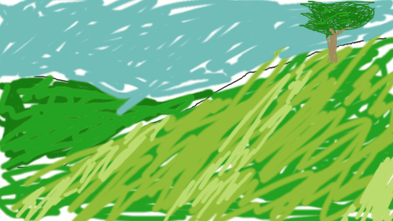
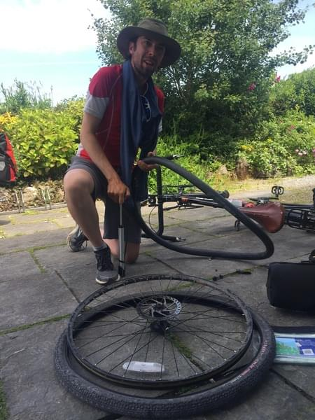
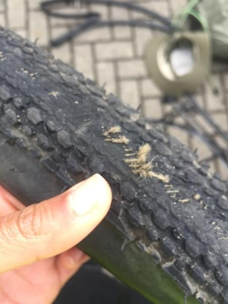
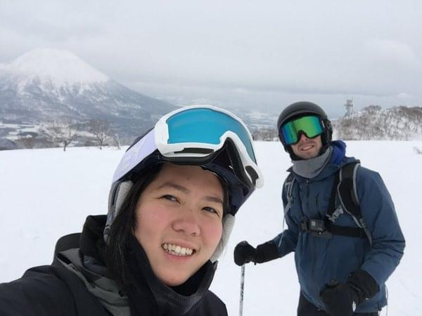
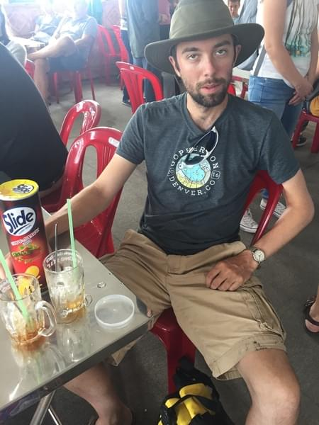
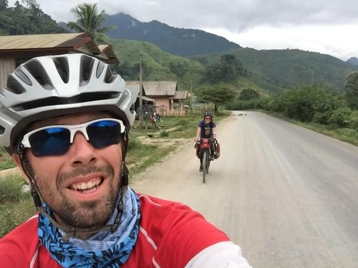

+++
title = "Andrew's Favorite Gear"
date = 2018-03-07T22:51:44+09:00
author = "Andrew O'Neill"
featured_image = "/post/andrews-favorite-gear/images/topgear.gif"
publishDate = 2018-03-10
categories = ["how-to", "gear"]
tags = [ "favorite" ]
+++

After traveling with the same four bags and wearing the same clothes
for the last nine months, I have formed some strong opinions about the
gear I brought. <!--more-->

## My Favorite Things

 My __top gear__ list.

### Tires

Our bikes are important, but the stock tires that came with it were
junk. After about two months, my back tire was worn to the threads. I
had fixed countless punctures during those two months, and started
carrying 4-5 extra tubes. I finally upgraded to some Schwalbe Marathon
tires and I haven't changed a single tube since. The 4 tubes now seem
like dead weight in my bag. Good tires make a huge difference.

### Rain Jacket

I never thought much about having a good rain jacket before we left.
Vicki had done some research on the jacket she wanted. She was
thinking of getting a pullover jacket that was light weight. We were
lucky enough to be living in Seattle so we went to the Outdoor
research store and checked out the jackets. Vicki saw the jacket she
had researched but there was only a Women's version. I was looking at
some of the full-zip Gore-Tex jackets they had. After a lot of back
and forth Vicki also decided to get a full-zip Gore-Tex jacket. This
jacket has been perfect. We've ridden through downpour rain, heavy
wind, and now went skiing and it has never failed us. On hot days you
can open the vents under the arms. On cold days it zips all the way to
your nose. If Douglas Adams had this jacket, he would recommend it
right after bringing a towel.

### Inflatable pillow

Sleeping is 1/3 of your life. (Less when traveling.) Having no pillow
or a shitty one will definitely annoy you if you're traveling for an
extended time. Having a pillow while camping is great. Sleeping on
folded-up clothes or a backpack can work but not everyday for a year.
Even in hotels and B&Bs the pillows can be uncomfortable. Having your
own pillow removes all these problems and will get you the rest you
need after biking the entire day. Inflatable pillows are tiny. Mine
rolls up smaller than some wool socks.

### Hat

A good hat is important. Since you're going to be outside all day
every day, you need something to keep the sun off your face and neck.
You'll still need sunscreen, but a hat will keep you cooler in the
long run. Vicki and I both bought an awesome Tilley hat. I lost mine
in Cambodia, which is one of the saddest moments of the trip for me.
It has a long brim on the sides and a bit longer in the front and
back. I'd wear it some days instead of my helmet to keep cool.
Whenever we stopped for lunch or to set up our tent I'd put it on. Man
I miss that hat.

 Moments before losing my hat.

## Needs Improvement

## Tent

A year before we even thought of doing this trip we bought a 2 person
tent at REI. It then sat in our closet for a year. Once we decided to
go we realized Vicki had never been camping. So, we unpacked the tent
for the first time and went camping in February. You can read about
that [here](). About two
months into our trip we realized our tent was a little too small. When
we are inside the tent there is no room for any of our bags. We
usually only keep our important (expensive) things inside the tent.
Everything else is either outside or in the porch (space between the
fly and the tent). Some nights I would have slept much better knowing
everything was inside the tent.

## Towel

My towel would disappoint Douglas Adams. When I was working I
purchased a "quick dry" towel so I could shower after riding to work.
I ended up only using it once or twice, but decided to bring it with
us on this trip. I'm not sure how they define "quick dry", but
compared to Vicki's towel mine was definitely not quick and often I
would have to pack it wet or hang it off the back of my bike. Also the
packed size of mine versus Vicki's was significantly different. Mine
was like a rolled magazine whereas Vicki's was like a bi-fold wallet.
I would definitely buy a new one for the next trip.

## Sun protection

Vicki bought us some neck protection called a Buff which was nice. The
problem for me was my arms were almost always exposed when it was
sunny. I had one athletic shirt that was long-sleeved, but I didn't
like wearing it everyday because of the smell. Athletic shirts or
anything polyester is going to stink more than cotton. Next trip I'd
bring more cotton long-sleeve button up shirts (so I could open them
when it's hot). I wouldn't bring pants to ride in though. Sunscreen on
my legs doesn't bother me as much as sunscreen on my arms and pants
would be way too hot. That said, Vicki wore leggings most days in
South East Asia to keep the sun off her legs.

So those are a few of my favorite things.
