+++
title = "Andrew's Favorite Pictures from England"
date = 2018-03-13T10:25:43+09:00
author = "Andrew O'Neill"
publishDate = 2018-03-17
featured_image = "/post/andrews-favorite-pictures-england/images/DSC_2516.jpg"
categories = ["journal"]
countries = ["england"]
series = ["favorite photos"]
tags = ["castles", "sheep", "camping"]
+++

We have taken thousands of photos while travelling. These are my favorites
from England. <!--more-->

> Click on the images for fullsize versions.

<a href="images/fullsize/DSC_0512.jpg">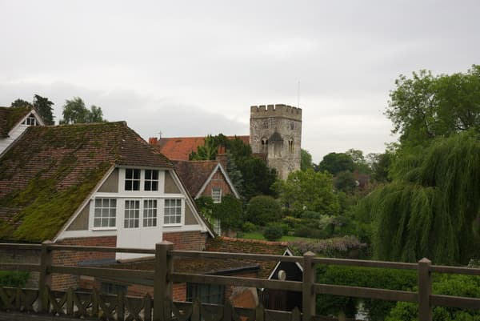</a>

This is a picture from the morning after our first day on the road.
We stayed at a Hostel in a very small village. This was the view from
a bridge that crossed into the neighboring village.

<a href="image/fullsize/DSC_0679.jpg">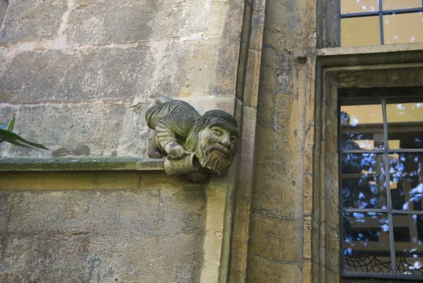</a>
 
<a href="images/fullsize/DSC_0680.jpg">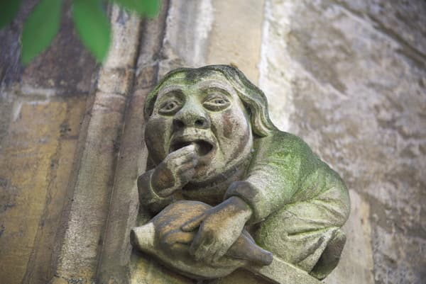</a>

Oxford was really beautiful. We went into many of the Universities in
the city. The gargoyles on the buildings are really unique. These two
were my favorites. I like the expressions on their face.

<a href="images/fullsize/DSC_0749.jpg">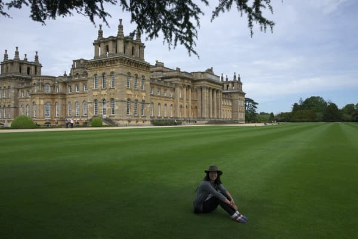</a>

When we rode out of Oxford we stopped at Blenheim Palace. The palace
is incredible, and the gardens are lush and elegant. We wandered around
here for quite a while. After visiting the rose gardens, Vicki sat here
claimed the palace hers.

<a href="images/fullsize/DSC_0777.jpg">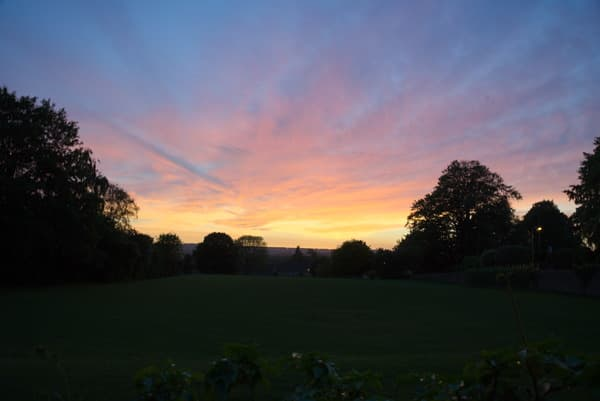</a>

One of the great things about camping is you usually can watch the
sunset. This photo was taken while we were walking back from a pub. It
also happened to be a lucky exposure number 777.

<a href="images/fullsize/DSC_0801.jpg">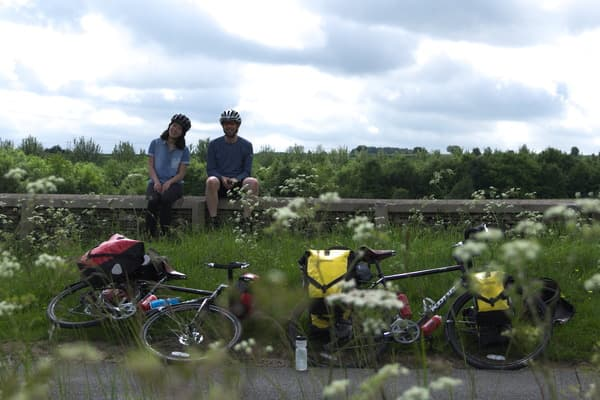</a>
 
<a href="images/fullsize/DSC_0802.jpg">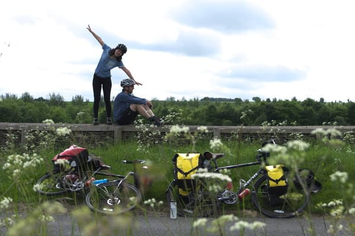</a>

We were riding down a small back road when we came across these stone
walls separating the pastures. The grassy meadows and rolling hills are
so beautiful in Cotswolds. I climbed through some thick brush to place
the camera on the opposing wall. Then, I ran back and posed for a few
shots. These two were my favorite. One sensible, one silly. For some
reason, I am much more fond of the pictures with our bikes in them.

<a href="images/fullsize/DSC_0869.jpg">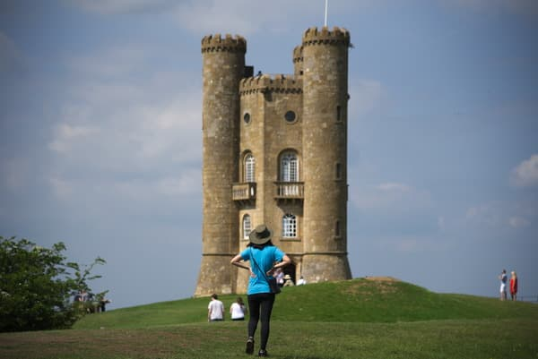</a>

We stayed two nights at a newer campground and did a day trip to some
of the surrounding areas. This tower was one of our stops. It was pretty
hot that day so we ate an ice cream cone under a tree near the tower. I
pulled out the camera to take some photos. Vicki went and posed in front
of the tower. Those photos turned out pretty nice, but this one is by
far the best (and my favorite photo from England). After Vicki had posed
for a few shots I took this when she turned around to view the tower.

<a href="images/fullsize/DSC_0895.jpg">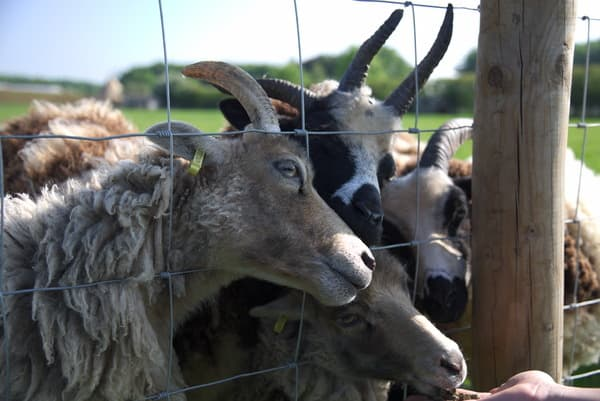</a>

The campground we stayed at was known for it's variety of sheep. We
bought a bag of grass pellets from the shop when we first arrived,
but ended up not using it. We didn't want to carry it in our bags so we
gave the sheep an early breakfast. They were timid at first but after
they realized we had food they went crazy. Their eyes are kind of alien
looking. I'm not sure if these were a special breed or just normal sheep.

<a href="images/fullsize/DSC_2414.jpg">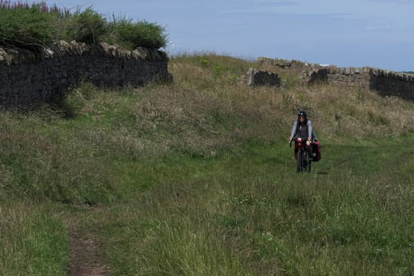</a>
 
<a href="images/fullsize/DSC_2415.jpg">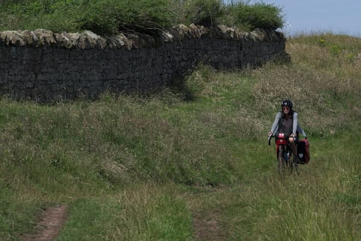</a>

After leaving Scotland we rode south to York. We took a shortcut through
a military test site. Luckily they weren't testing anything that we could
notice. Riding through this dirt trail was pretty tough. My wrists were
pretty sore afterwards. To my surprise the bikes held up fine through the
bumps. My faith in them was pretty low since Vicki's back rack snapped at
the weld while riding on a smooth paved road a day or so earlier. This
path was along the ocean but I cut it from the picture to show more of
the path. You can see it in the fullsize photo.

<a href="images/fullsize/DSC_2429.jpg">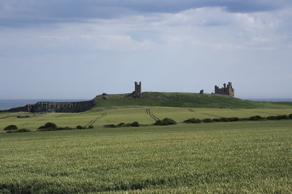</a>

By this point we had seen tons of castles. The route we were following
is called Coast and Castles. Many of the castles have that cool medieval
look, and were in much better condition than this one. I like this photo
the most because there are no other buildings around. Most castles were
in towns surrounded by cars, and tourist stuff. This one I feel like
I'm looking at the castle 300 years ago.

<a href="images/fullsize/DSC_2433.jpg">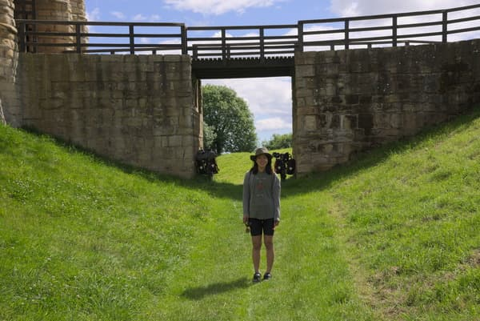</a>

On bikes you can pretty much park anywhere so we parked in the moat
of this castle under the drawbridge. We were planning on going in this
castle, until we saw the entrance fee.

<a href="images/fullsize/DSC_2516.jpg">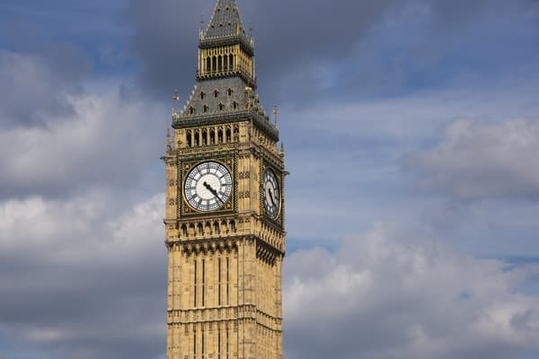</a>

I was hoping to get a great picture of an iconic London building. This
is the best one I managed to get. Many were crowded with other tourists,
or only visible through gates. I wish I had gotten the top of the tower
in the photo.

<a href="images/fullsize/pigsticks.jpg">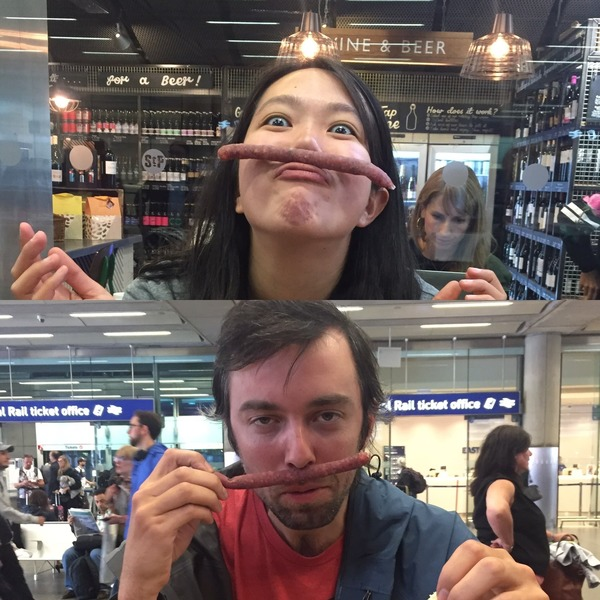</a>

This is a fun one. After sitting at Kings cross for a few hours we
started to go a little crazy. We bought some "pig sticks" at the shop
near us and did our best French impressions.
