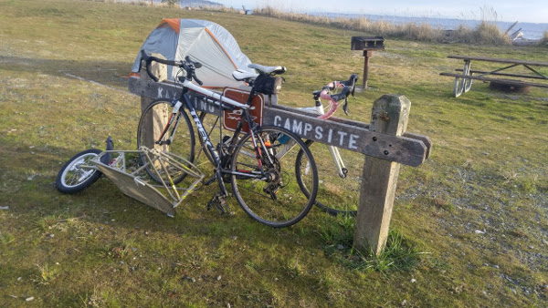
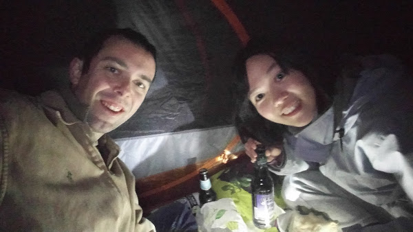

+++
date = "2017-02-02T18:56:40-08:00"
title = "Not Quite Camping"
author = "Vicki"
featured_image = "/post/first-post/images/20170129_085202_HDR.jpg"
publishdate = "2018-02-20"
trip_date = "2017-02-02"
+++

After deciding to quit our jobs and go travel, the first thing that
needed to be done is go camping … because I have never been
camping.<!--more-->

I picked out a campground close to Seattle - Fay Bainbridge Park (4
miles biking - 30 min ferry - 6 miles biking from home) - PIECE OF
cake! For me at least, Andrew was carrying everything with a BOB
trailer. I also insisted on bringing 6 bottles of beer in a beer
carrier that wasn't meant for road bikes.

We arrived kind of late. It was dark. 

We picked a spot close to the beach :) woohoo~

Put up the tent - easier than I thought. 

Sat in the tent and started drinking beer to celebrate. 

Dinner was soggy subway we brought - tasted amazing. 

The park ranger stopped by and said "hi" - glad we paid. 

We drank more beer and used the toilets - I was so surprised on how
clean the lady's room were … Andrew said his wasn't that great.

The only neighbor in the entire campground went to sleep - he put out
his fire (we didn't think of having a fire).

We finished the beer and went to bed too. 

I was cold and woke up to put on more clothes…

I was still cold. 

Andrew was moving - I think he was cold too. 

The wind wouldn't stop blowing. 

I heard the waves from the beach. 

I was cold. 

Very cold. 

Sort of slept - okay don't think I slept at all. 

The sun peeked in - thank god. 

We ate our granola bar breakfast and banana - realized we forgot to
feed Oscar. 

Left the campground very early because we need to feed Oscar. 

The way home was easy for me again. Andrew carried everything. 

Turned out we brought too much water. Didn't need them at all. I had a
lot of fun! Sleeping outside definitely gives me a different
perspective to my bed. We probably shouldn’t have gone camping in
winter and picked a beach spot … Also should have thought
of building a fire. HEHEHE.

Anyway. __I am capable of biking 10 miles and camping outside in the
cold!__

