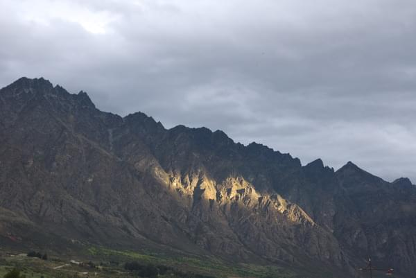
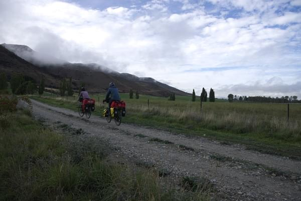
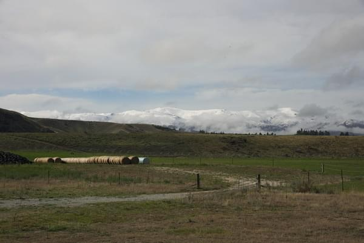
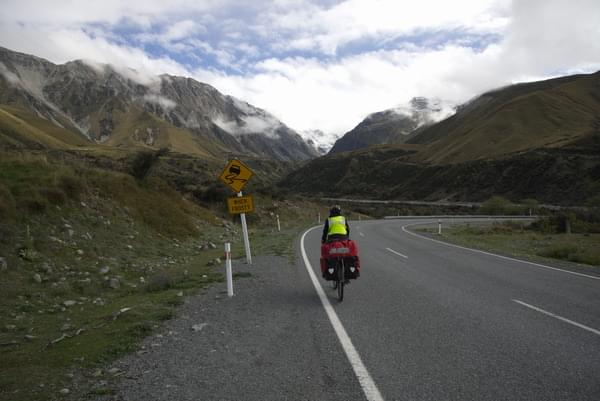
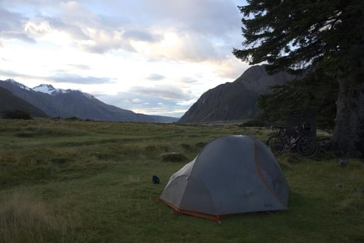
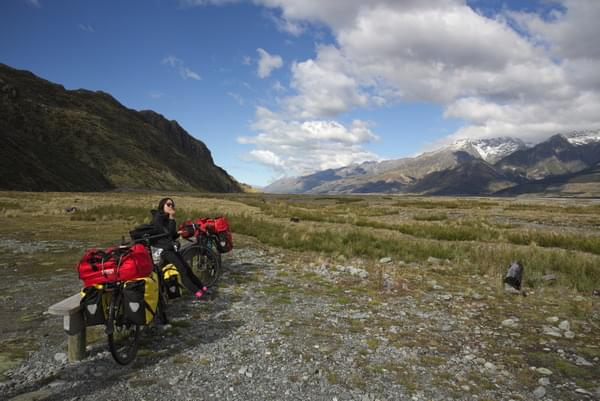
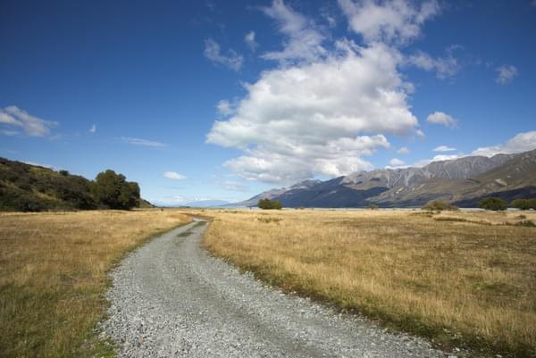
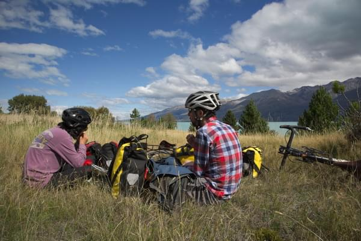
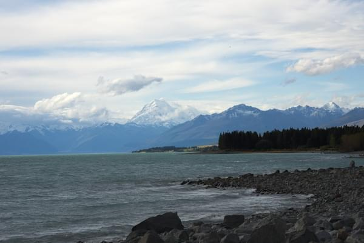

+++
title = "First Thoughts on New Zealand"
date = 2018-03-26T17:21:43+13:00
author = "Andrew O'Neill"
publishDate = 2018-03-31
featured_image = "/post/first-thoughts-on-nz/images/DSC_7905.jpg"
categories = [ "Journal" ]
countries = [ "New Zealand" ]
series = []
tags = []
+++

We arrived in Middle-Earth less than a week ago. Here are our impressions
from the start of our trek to Mount Doom. <!--more-->

 

Well we were actually headed to Mt. Cook.  But that's details. When we
arrived we did the normal thing, and immediately begin panicking. Who
knew you should plan things ahead of time when you are traveling in
foreign countries?

We planned to ride a train on the last part of our journey, but when we
started to check train times we noticed a weird warning. There was an
earthquake two years ago that damaged the rail and highway along the
coast. So _plan B_ is to ride 650+ extra kilometers. We'll try to get
some buses along the way.

Next thing we noticed is March is not summer in NZ. It's pretty
chilly. The rain (and snow in higher altitudes) made things even
colder. When we crossed a high mountain the temperatures suddenly dropped
(this is not a myth after all). The descent was bone-chilling. We
were soaked and now also experiencing freezing temps and wind from the
speed. When we spotted the first signs of civilization we stopped and
spent the night.

Which brings us to the third realization. NZ is expensive. At least
from what we've experienced thus far on the South Island prices for
hotel/motel are as expensive as NYC or a luxury resort. The first night
we were willing to pay full price, but we saved a lot by camping the
rest of the nights. Food prices are about the same as America. Not too
bad but not great for a tight budget. The beautiful landscapes make up
for the price you pay.

New Zealand is beautiful. I am so amazed. It's hard to bike
more than 10 minutes without wanting to take another photo. In areas
that seem like they'd be major tourist hubs it is still easy to be the
only people there. When we biked to Mt. Cook and Lake Pukaki there were
times where you could see around 20km away and not see another person
or car or caravan.

The funny thing about caravans, they seem to be 75% of the traffic on the
roads we've been riding. I thought New Zealand was big on "wild camping"
or what they call here "freedom camping" but they seem to ban it in many
areas. This creates camping parking lots. Freedom camping is a weird
name for something that NZ enforces. It was funny for us to pass a full
freedom parking lot after spending the night alone on the shore 10km away.

I can't wait to see what the rest of New Zealand has to offer. So far
I'm very impressed.

Mount <del>Doom</del> Cook

