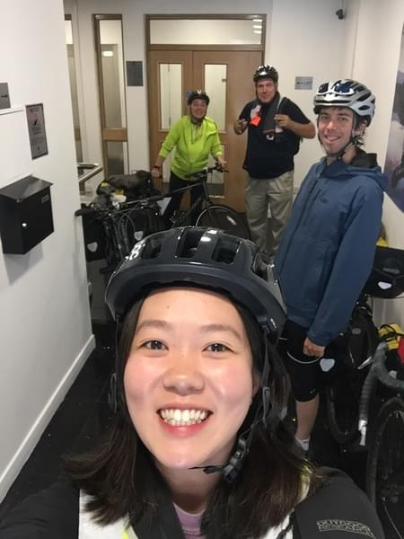
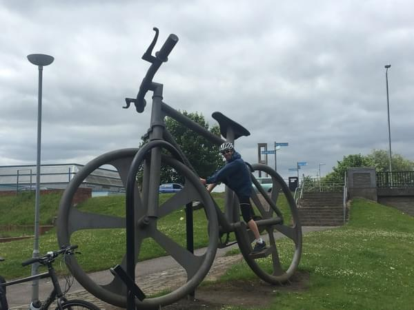
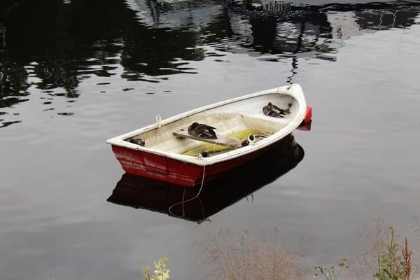
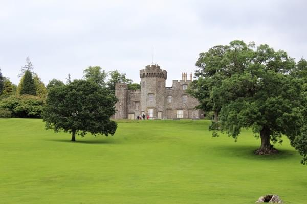
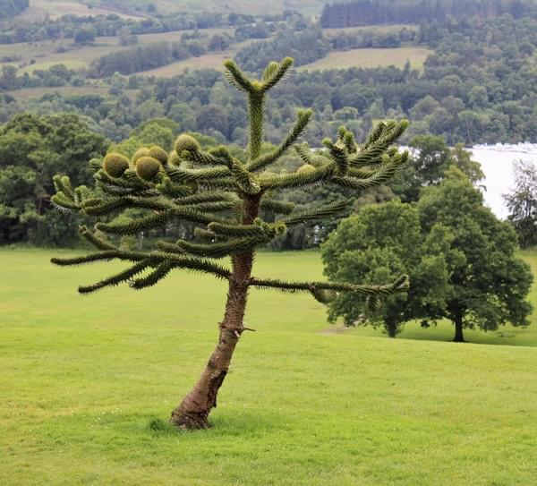
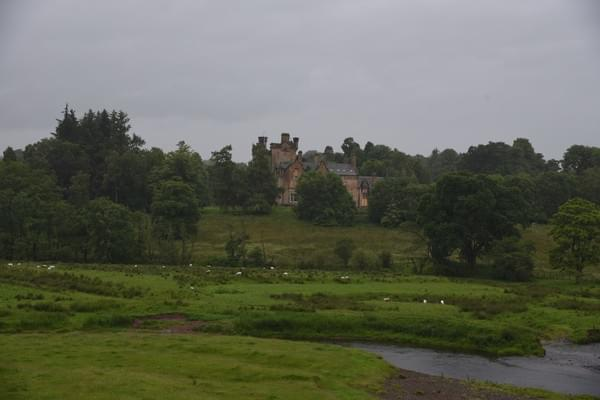
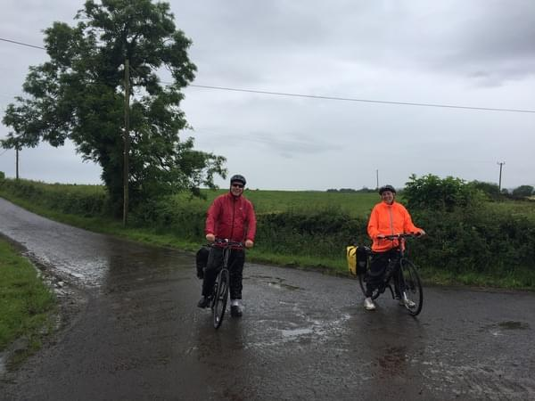
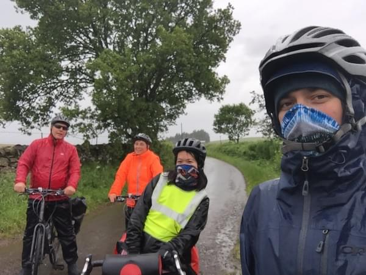
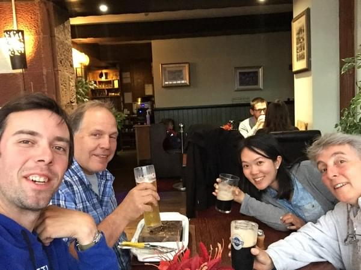

+++
title = "Glasgow to Aberfoyle"
date = 2018-04-28T19:34:38+01:00
author = "Andrew O'Neill"
publishDate = 2018-05-12
featured_image = "/post/glasgow-to-aberfoyle/images/IMG_1185.jpg"
categories = ["journal"]
countries = ["scotland", "uk"]
series = ["uk", "a lap around scotland with my mom"]
tags = []
draft = true
+++

Now that we're all together we're off to the races. <!--more-->

	
## First Day on the Road

In the morning, we all got up, made some breakfast, checked out, and were
ready to hit the road. Wende and Dan had hired (rented in American) some
bikes from a local shop. They were basic road bikes with a rear rack for
panniers. We started by riding back to the shop so they could leave some
luggage. I also bought them some water bottles and got some more spare
tubes. Then we headed northwest toward the first destination, Balloch.

We hadn't really planned much. Wende had made a reservation at Pitlochry
so we chose a route that would get us there. After cycling through England,
Vicki and I were pretty familiar with the national cycle routes. We
chose to follow route 7 from Glasgow all the way to Inverness. The
first day was pretty easy. A walk in the park for Vicki, Wende, and I.
Dan (non-biker) seemed unphased as well. The ride out of Glasgow
was not that exciting, pretty urban. We took a small break for lunch at
a little coffee shop. The rest of the ride was nicer. The route moved
away from the urban areas and got out into the woods. We arrived in
Balloch between 3-4PM. We attempted to stay at a campsite. The
only one in town did not allow tents though. We ended up staying at
an inn on the main road.

Wende and Dan went out for a walk around the area. They took some
pictures of the lake and castle. Vicki and I watched tv and drank a
beer. Later we all had dinner at the restaurant downstairs together.
After a good meal we all went back to our rooms and agreed to get up
early, around 8AM, to start our next leg of the trip.

## Riding in the Rain

When we got up the sky was not looking very happy. We rode down the street
to the grocery store to get some food for our ride. After stocking up
on energy bars, and dried fruit we left for Aberfoyle.

We continued along route 7 and encountered our first few hills of the
trip. After riding over some of the hills in Ireland Vicki and I were
accustomed to the weight of the bikes and the effort needed to ride over
a hill. Dan and Wende had not experienced this yet and for them it was
really tough. On the steeper sections both of them would get caught
in the wrong gear or already _red lining_. We later got in the habit
of calling out hidden hills or steep inclines, which Vicki and I would
sometimes do lovingly later on. This day was really tough.  After about
an hour of overcast skies the rain came in full force. The rain drenched
us and it was freezing cold. In a small town, Dan bought some waterproof
boots to cover his shoes while riding. Then we had lunch at a pub.
We were all really cold and wet, but the tea and meat pies warmed us up.
After a long lunch we continued on in the rain for another few hours.
Finally arrived in Aberfoyle.

Since it was still early we went to a wool shop before trying to find
somewhere to stay. It turned out to just be a store for tourists. I'm
not sure the wool was even from Scotland. We left and went to find a
place to spend the night. For Vicki and I finding places to stay had
been relatively easy. We rarely booked places in advance very often and
typically found a room at the first place we asked. This was not true
when travelling with 4 people. The first place we tried only had one
room. Then Vicki asked at one inn while I asked at another. Both were
fully booked. We eventually went to the tourist info and asked them about
where to stay. They found a B&B for us and we were very relieved. Before
this I had never considered that we might not be able to find a place
to stay the night. I was really worried that we'd have to split up or
wild camp somewhere. Luckily it all worked out.

That night we went to a cool stone grill restaurant. They had some really
hot stones that they put some big slabs of lamb or steak and the stone
cooked the meat. It was really good and then we got to introduce Wende
and Dan to Sticky Toffee Pudding. Dan somehow convinced the waitress to
let him keep a pint glass. It would become one of the many glasses Dan
would carry around Scotland and then home to Buffalo.
