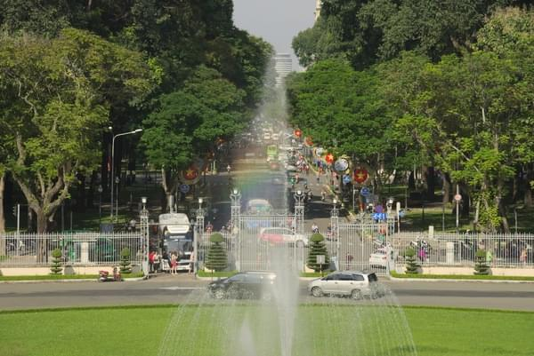
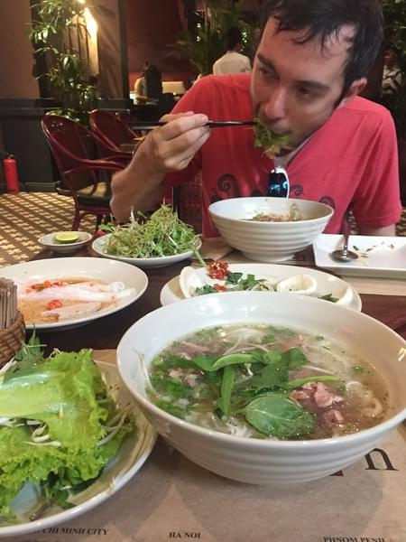
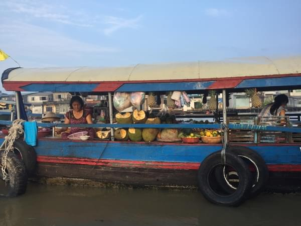
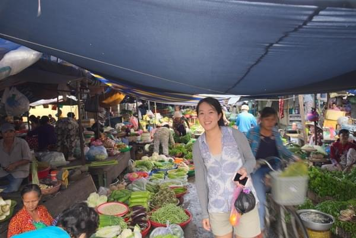

+++
title = "Hey this is crazy, but let's go ride in Vietnam"
date = 2018-05-27T12:18:49+02:00
author = "Vicki"
publishDate = 2018-06-10
trip_date = 2017-10-31
featured_image = "/post/hey-this-is-crazy-but-lets-ride-in-vietnam/images/IMG_4519.jpg"
categories = ["journal", "first times", ]
countries = ["Vietnam"]
series = ["South East Asia"]
tags = ["canals", "floating market", "food"]
draft = true
+++

I was very nervous when we decided to bike in South East Asia. It just seems a little too crazy… <!--more-->

### It ended up being one of the best decisions I have ever made.

## I Dream of Rice Noodle Soup

We started our journey in Ho Chi Minh City. With more than 7 million motorbikes, it was insane! There were motorbikes going in all directions (yes including against the traffic or motorbike jaywalking). Traffic light is definitely just for reference...The jaw-dropping part is that it seems to work. After getting used to dodging cars and motorbikes, we were ready to have a blast in food paradise.

Even though sometimes, we are not 100% sure of what exactly are we eating…
Like this big snail ...

Shaved ice with stuff? it was super good by the way.

Or end up having dinner with an unwelcome guest… a rat was enjoying a left over bowl of fish noodles right next to us. Maybe he's Remy from Ratatouille traveling to Vietnam.

But I LOVE Vietnamese food. If Jiro is dreaming about sushi, mine would be the spicy, sour Pho or I-don't-know what it is rice noodles/cold tofu and meat dishes/rice with stuff/Banh mi etc.

## Chasing along the Mekong River from Cailay to Chau Doc

After a few nights in Ho Chi Minh City, we hired a van to Cailay (90km south of Ho Chi Minh) and started our ride along the Mekong Delta area. The driver wasn't sure if he can just leave us along the road, since we were in the rural area. We pointed at our bike and assured him we’ll be just fine. Will we?

### Giethoorn of Vietnam

We peddled on the paved road with the cars for a bit, then quickly turned onto the narrow dirt roads surrounded by canals and banana trees. The scene is really eye-opening. There were tiny bridges to little homes and barking chickens running everywhere. It was fun zig-zagging between the water and villages.

As we were riding, we hear a lot of locals singing karaoke. Some sang so bad that we couldn't help giggling. Maybe I'm not that bad at singing after all! There were also a lot of dogs. I was super scared of getting chased at so I made sure Andrew was ahead to risk his life for me. Turns out, Vietnamese dogs are mostly little yappy dogs.

### Cai Be Floating Markets

We woke up early to visit the floating market. Not the usual market I had in mind for sure… there were people washing dishes, clothes, themselves with the river water. People cooking and selling fruit and vegetables. We were mostly in awe of what we are seeing and were trying real hard not to think of what is in the water.

We even hopped on a canoe and did a little trip through the canals. It was kind of like cruising in the sewage water but with an authentic vibe of course.

### Riding through the rice fields and splashing puddles

The Mekong river area was really nice to bike on. There were backroads everywhere. And surprisingly, despite the heavy motorbike traffic, the Vietnamese are really good at dogging us. They give us enough space and are always happy to see us. We were invited to have some food even when we couldn't communicate at all (we kind of invited ourselves by accident since we thought it was a café) But the owner and their friends were so nice and I think they were impressed by us biking… wish I can speak Vietnamese…

Here's us hiding from the heavy rain with fellow commuters!

Needless to say, my first impression of riding in Vietnam is definitely a blast. I love it.

Me at Chau Doc Market.

## Our Epic Ride in South East Asia Overview

### Ho Chi Minh to Bangkok
Distance on bike: 1200km  
2 trains (Surin to Nong Khai, Chiang Mai to Bangkok) 
2 boats (Chau Doc to Phnom Penh, Luang Prabang to Huay Xai)

Andrew having a blast at the backpackers ally in Ho Chi Minh City.

Hopping on ferries between the Mekong Delta.

Us getting on a ferry.

