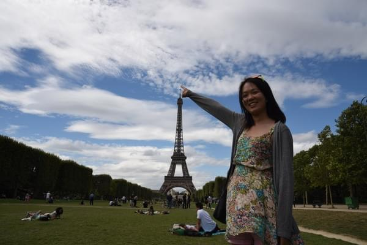
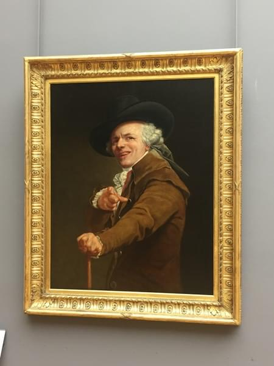
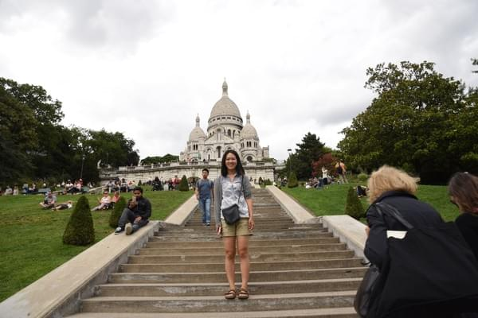
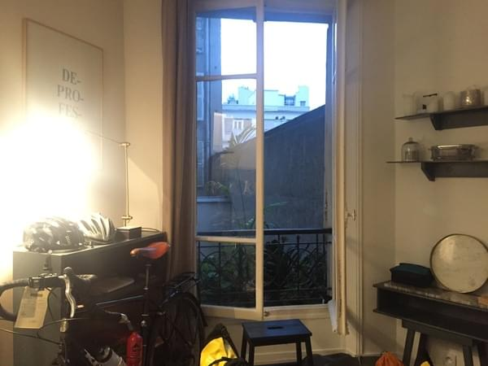
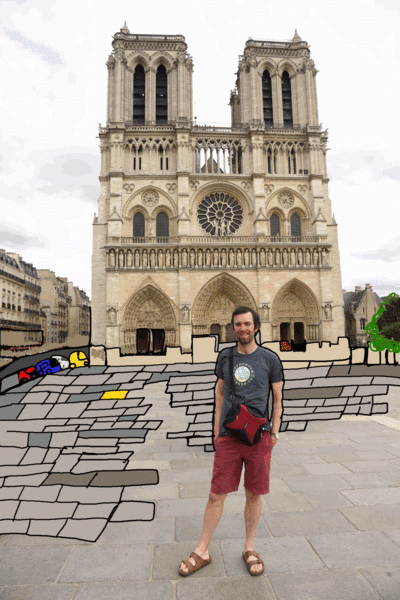

+++
title = "Let's get lost in Paris"
date = 2018-04-04T14:49:30+12:00
author = "Vicki"
publishDate = 2018-04-09
trip_date = "2017-08-03"
featured_image = "post/i-would-move-to-paris/images/DSC_2671.jpg"
categories = ["journal"]
countries = ["france"]
series = ["france"]
tags = ["Paris","love"]
+++

It was love at first sight. I would put on a dress for Paris. <!--more-->

Paris was the very first place we visited in France. And oh my, I totally dig it. We stayed at two different Airbnbs. We had the whole apartment to ourselves and were able to pretend that we  live in this beautiful city.

I love the small cafes, cobblestones streets, and people walking everywhere. Every corner of the street seems to have the magic of lightening your day.

Here's Andrew enjoying himself in the sun.

## Highlights of Paris

### The French really knows how to eat a meal

After being in France for a little bit, you'd notice they really take their time enjoying a meal, a cup of coffee, a piece of cake, or a glass of wine (okay many glasses of wine). The love they have for food and how they take their time is so fascinating. When we were at a restaurant, we never felt rushed. The waiters takes their time getting our drink orders first, then L’Entrée, the main, cheese plates, desserts and an espresso in the end.

It seems to take at least 2 hours for one to eat their dinner. It takes some patience to get use to it, but I really enjoy spending time eating together, or even by myself. We saw a lot of French enjoying food among themselves. Plus the bread on the table always tastes amazing! Not sure about the coffee after dinner though, I tried it a few times and always end up wired all night…

What ever that was, it was good.

### Arc de Triomphe

We love Arc de Triomphe so much that we visited it 3 times during our stay in Paris. One during the day, one at night and one riding our bikes around it. The last part of riding through the traffic was a very very very bad idea. Cars were squeezing me from all directions, I think everyone driving around the Arc were all panicking and realizing that we all made a huge mistake. But I still love the Arc! I think it's prettier than the Eiffel Tower (WHAT?!).

Me having a blast at the Arc! Dizzy

### Eiffel Tower

I prefer Eiffel Tower with a bit of a distance. Because up close, there are just too many people. Or maybe it's kind of like a fantasy, you need some room for imagination. We enjoyed walking at the park (Champ de Mars) near by and of course doing our signature pose of jumping like lunatics!

I think the charm of Eiffel Tower is that everyone all have a unique emotion when first seeing it. It screams Paris, and what is Paris to you? Maybe it's just a famous tower…

### The Louvre

I really don’t want to admit it. But I only know the Louvre from the movie "The Da Vinci Code" (yes the one with Tom Hanks in it). I also seem to be more impressed by the triangle window thingies than the art inside… I'm joking! Of course I enjoyed all the masterpieces and was dazzled by it!

After visiting several art museums, I think it's important to have lunch on time. Because the last thing you want is getting lost in a museum and realizing it takes miles to get to the food court (The Louvre in particular). We also enjoyed The Musée d'Orsay museum, it's more our taste than Mona Lisa.

HA!

### Sacré-Cœur

I never heard of this place before going to Paris. Maybe it's the surprising factor, but I really like this church. It sits on top of a hill. The little hike up there is fun and once you get up there, the city view is beautiful. A lot of people were having a picnic or taking a nap on the grass. The bottom of the hill is a little sketchy, but should be safe since it's very touristy.

### Voilà 

Everyone will have a different experience of Paris! I say we should just all get lost in Paris for a few days - pick a café with seats facing the pedestrians, do some people watching, walk along River Seine, have some wine and bread, read a poem in the sun, pretend to know art, buy a fresh baguette, smell the roses. Ahhhhh, Paris does make you a hopeless romantic.

Andrew reading a book in Paris.

Yummy snails.

French doors at our Airbnb apartment.

Andrew and Notre Dame.

Paris Opera

It's a cool cat.

