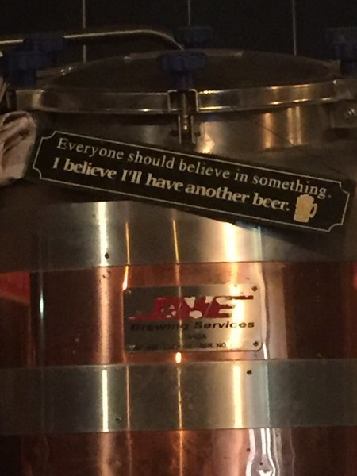

+++
date = "2017-06-05T18:56:40-08:00"
title = "Ireland - Rosslare to Kinsale"
author = "Vicki"
featured_image = "/post/ireland-1/images/600x600_DSC_1399.NEF.jpg"
publishdate = "2018-03-10"
trip_date = "2017-06-05"
categories = [ "journal" ]
countries = [ "Ireland" ]
series = [ "Ireland" ]
tags = [ "rain", "misery" ]
+++

8 months on the road and Ireland is by far my favorite country! We love the beer, the people, and the stunning views of the Wild Atlantic Way. <!--more-->

The Wild Atlantic Way stretches along the west coast of Ireland and it is truly beautiful. The whole route is over 1600 miles. And we rode all of it!

Okay we only rode part of the Wild Atlantic Way, but it was amazing (Guinness amazing). We rode from Kinsale to Galway around 500km in 2 weeks. The first week felt like it never stopped raining…we were wet most of the time. Normally I would have hated it, but the beaches, dramatic cliffs, and the unique landscape are just too gorgeous. After riding in the wind and the rain, I really felt like I understood the Atlantic ocean (It's beauty and cruelty)… There are also many lighthouses on the way. My favorite is the Fastnet Rock lighthouse which we saw from 5 miles away. It's the most southerly point of Ireland, located on a tiny island. It's cool to think that it was the last part of Ireland that the Irish Americans saw as they sailed to North America.

## How we started our trip in Ireland…

We started our journey to Ireland on a ferry from Fishguard to Rosslare. The ferry ride was only 3 hours but OMG, it was the harshest sea sickness I've ever experienced. I went from excited about the huge waves to dying from puking. The lady's room sounded like a symphony of puking. I probably should have thought harder before I ordered the tuna sandwich.

Us just 10 mins on the ferry

20 mins later

After the miserable ferry ride, we rode out with the Harleys (there were a ton of them on the ferry, ready to ride the Wild Atlantic Way).

## Waterford

Waterford was the first city we rode to. We stayed at an Airbnb. The host was very nice, but I was a bit grossed out by the bathroom and kitchen. (That was before riding through Laos). Waterford is the oldest city of Ireland built by the Vikings a thousand years ago. We enjoyed walking around Reginald's Tower and missing the Waterford Crystal. (Heard it's a must see if you visit Waterford.)

## Cork

We took a train from Waterford to Cork. Cork is one of my favorite cities in Ireland. It is said to be the rebel city. I always wanted to be a rebel, even though I'm just a normal nice kid. We went to a brewery tour at Franciscan Well Brewery. The Irish tour guide was super funny and they were generous on the sample size. We also witnessed some Americans ordering pizza and coke at the brewery…

The famous Blarney Castle is also near Cork. It is famous for it's Blarney Stone. Legend says that if you hang upside-down to kiss the stone, you will get the gift of eloquence (elegant and good at communications?). We skipped it because there was a 2 hour wait to kiss the stone… and here's a beautiful view of the castle under construction.

## Kinsale

Originally we planned to camp, but we were soaked and cold when we arrived at Kinsale. We decided to go baller and check in a very nice Inn. It was one of the best nights. Since we were staying at such a nice place, it made sense to eat at a really nice restaurant as well. We had some wine and walked around the little allies of the town. Despite the rough day in the rain, I really enjoyed the fishing town and had the best hot shower I've ever had.

After Kinsale, we kicked off our journey following the wild Atlantic way. There were signs everywhere, making the navigation super easy. We biked through James Fort and the old head. Both had breathtaking views.

Old Head of Kinsale

James Fort

Rosslare Harbour

Waterford Graffiti

Blarney Castle House

Riding along the beaches

Here's Andrew having fun at the Cork playground!

