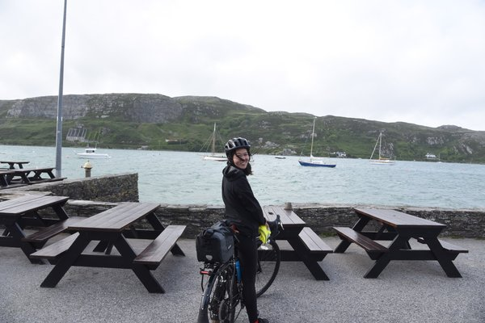
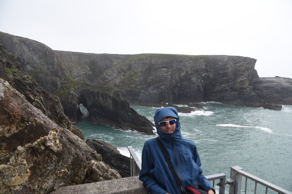

After one week of rain in Ireland, we continue our journey in the rain...<!--more-->
## Camping out in the storm

After riding out of Kinsale we rode through Glandore. It's a tiny fishing village with a cute little harbor. There was a storm during the night we camped out. The camp lady was concerned and told us we can set up our tent indoors if we like. But we are tough and invincible (or lazy to move). 

Andrew cooked our dinner - White rice, curry paste and pepperoni. All tasted amazing with the wine.  Then we went to bed. The whole night the tent was rocking and I thought for sure we were going to fly at one point…but those REI tents are amazing! We were able to pull it through the night and have survived camping in the wild storm of Ireland. I still feel super badass about it. 

## The grave built 4500 years ago - Altar Wedge Tomb

It was a long day on our bikes when we passed Altar Wedge Tomb near Crookhaven. Riding along the coast was so stunning that we almost missed the super old grave. The little tomb was just sitting close to the water. I thought there would be restrictions or some sort of fence around the tomb. But nope, it was just right there. I can even lie under it with the sacred souls or hug it if I wanted to. We had some snacks and enjoyed absorbing some of the ancient spiritual energy.

## Crookhaven and Mizen Head 

It was a super long day when we got to our campsite close to Crookhaven. We biked around 60 miles that day, but the last 10 miles into Crookhaven and the peninsula was absolutely magical - fishing boats sheltered in the curved port, old pubs on a long narrow road surrounded by water, and the mystical fog from the ocean. Yes. I would like to come back again. 

We camped at Galley Cove only a mile away from Crookhaven, the facility was great (5 star camping site). We then had dinner at Crookhaven Inn. I remember having a great time but not really what we ate. I'm sure we had some potatoes though. The next morning we went to Mizen Head. We were a bit early before it opens, so we walked around and took some nice profile picture. 

Like this one

Mizen Head is the most south west point of Ireland. And the cliff views were even better with the windy weather. We walked around in the rain and enjoyed watching the waves crashing on to the rocks. We also spotted a seal swimming near by. 

Mizen Bridge

The most west south of Ireland

Andrew cooking dinner

<iframe src="https://www.youtube.com/embed/XADeioghotU" frameborder="0" allow="autoplay; encrypted-media" allowfullscreen></iframe>

