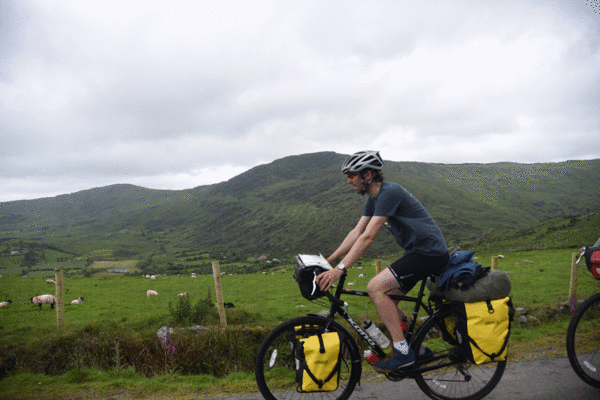
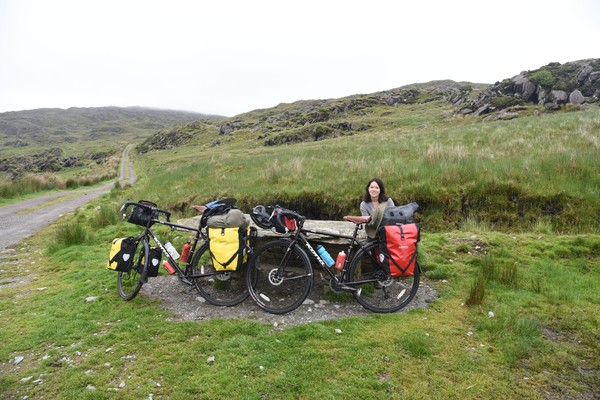
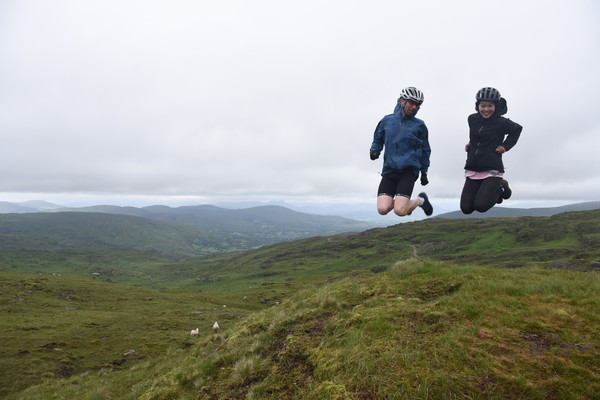
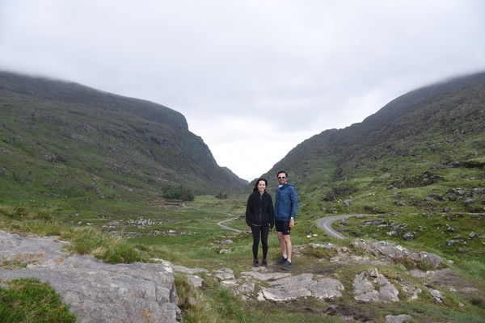
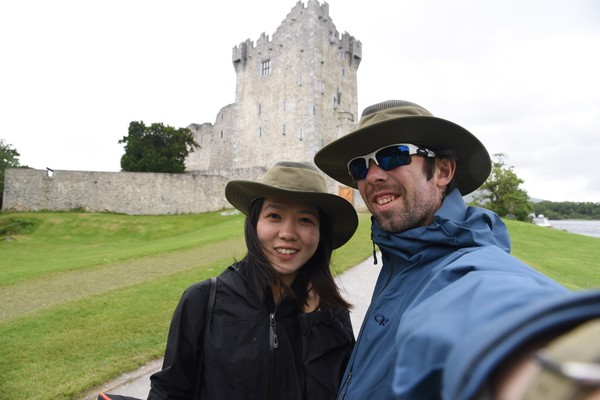
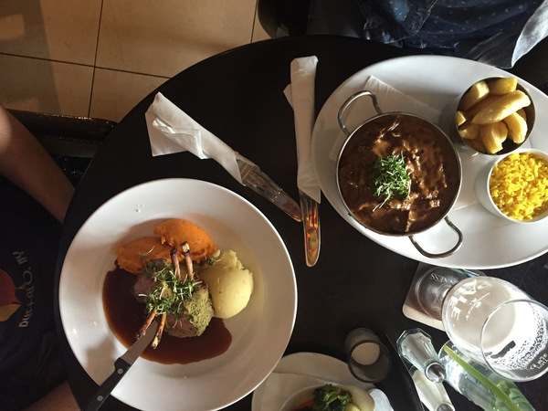
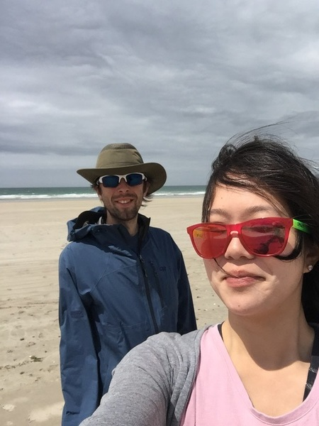
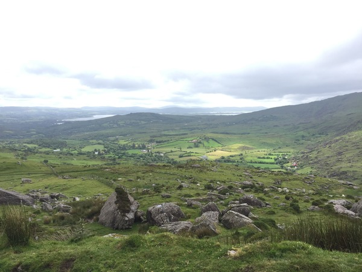

+++
date = "2017-06-15T18:56:40-08:00" #test
title = "Ireland - Killarney to Tralee"
author = "Vicki"
featured_image = "/post/ireland-3/images/DSC_1539-ANIMATION.gif"
publishdate = "2018-03-21"
trip_date = "2017-06-15"
categories = [ "journal" ]
countries = [ "ireland" ]
series = [ "Ireland" ]
tags = [ "rain", "sheepdog" ]
+++

The ride from Bantry to Killarney was like a dream come true.  <!--more-->

## Priest's Leap

Priest's Leap is a must go. If you plan to ride a bike in Ireland, and if you are okay riding over gravels, steep, and narrow roads up a mountain. Then YOU NEED TO RIDE OVER PRIEST'S LEAP! It's worth the effort. I had to walk my bike up a few very steep slopes. But the view is absolutely stunning. We had a great time riding along the sheep dogs and tractors. 

Here's us with the sheep dogs. 

We stopped here for lunch.

And did a jump photo.

## Gap of Dunloe

We didn't even know about Gap of Dunloe until we rode pass it to get to Killarney (an old Irish town with beautiful surroundings). The route from Kenmare to Killarney goes through Molls Gap, Blackvalley and Gap of Dunloe. All gorgeous places along the valleys and mountains. My favorite part is riding along the winding stream down the valleys. 

## Ross Castle 

It’s a 15th century built tower castle close to Killarney.

Here's a selfie of us! 

## Tralee

After the beautiful Killarney area, we took a shortcut on the train to Tralee. Tralee itself was an alright biggish Irish town. Our Airbnb host was super nice to us. She called us her darlings and recommended us the best Irish bar in town (Sean Og's). We got there way too early around 7pm since we had dinner close by. But we decided to hang around since there was a band coming soon. We end up staying till 11pm or so.  It was a blast - bar tenders singing, everyone singing and locals chugging beer like water. 

Our dinner at Tralee. 

After Tralee we headed north along the coast to Ballybunnion. Too bad we had to skip Dingle, but we saw it from far away. Some local told us how can you not visit Dingle if you visit the Wild Atlantic Way…

The BEACH! 

More beautiful pictures of Priest's Leap.

