+++
title = "Killin it in Scotland"
date = 2018-05-04T09:06:46+01:00
author = "Andrew O'Neill"
publishDate = 2018-05-26
featured_image = "/post/killin-it/images/DSC_2059.jpg"
categories = ["journal"]
countries = ["scotland", "uk"]
series = ["a lap around scotland with my mom"]
tags = ["waterfall", "bar", "camping"]
+++

On this stage we ride up a mountain to a waterfall then around some
lakes. We relax with some live music. <!--more-->

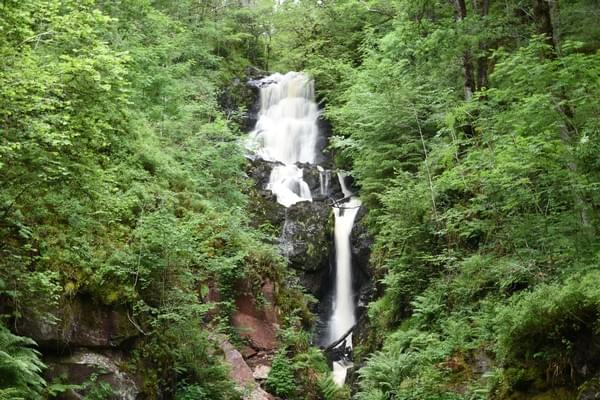

## A Tough Climb out of Aberfoyle

<video src="images/test.webm" loop autoplay muted>
<source src="images/test.webm" type="video/webm">
<source src="images/test.mp4" type="video/mp4">
Sorry, you can not play videos. Try chrome or firefox.
</video>

After a good night's sleep in Aberfoyle, we had a nice breakfast at the
B&B then headed off for our next destination, Strathyre. The first part
of the day was really tough. There was a long, steep hill right off the
bat. The path then switched from paved to dirt. The trail weaved through
the forest avoiding the highway. There were many pretty waterfalls and
lakes along the way. We stopped and took lots of pictures. The hills
and dirt trails began to wear us down.

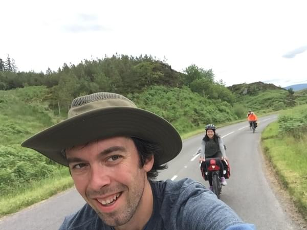

I decided we should take a shortcut. The shortcut lead us out
onto the highway (not what I was expecting) then back around to a
rest/viewing area. From there we rejoined the trail. It probably wasn't
a shortcut. Sorry Mom. At the bottom of the lake I thought we could do
a hike to get to an area of interest, but we soon lost interest since
it was a steep climb up slippery muddy slopes with no indication that
we were even going the right way. Trust in my navigation skills wasn't
at its highest.

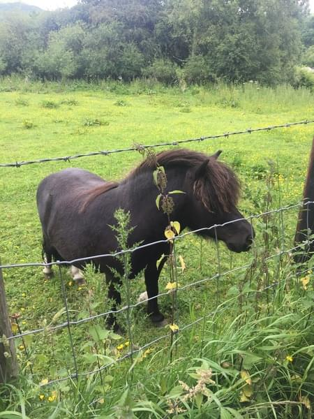

The route continued along a lake then joined a stream. When the path
opened up at the end of the lake, we stopped to take pictures of miniature
horses and the scenery. It seems like all the horses in Scotland were
miniature. We continued along the trail through a log cabin resort and
crossed a river eventually arriving in Strathyre. We decided to camp
since we had stayed in B&B's for the first few nights.

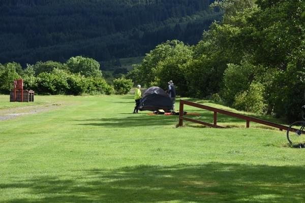

Vicki and I picked a spot and set up our tent. Wende and Dan set up
their tent near ours, decided that something was wrong with that spot:
it smelled of rotting grass, and then carried their tent 100 meters away
to a spot more suitable to them. We walked around the town, there wasn't
too much, a few inns and a pub. We went to the only restaurant that was
open and had some beers. The owner of the pub sat with us and offered
to drive us to one of her favorite places in Scotland. We couldn't take
her up on the offer because we were on a schedule to get to Pitlochry
(the reservations could not be cancelled). We later ended up having some
food as well. It was probably lamb and definitely had potatoes.

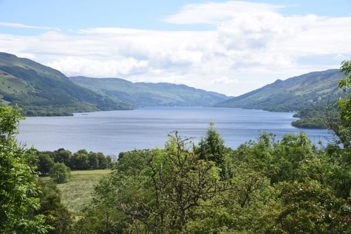

Camping was fine: surrounded by mountains next to a small stream. I
had suggested that Wende and Dan bring mats to sleep on and pillows. I
should have probably suggested to buy a 3 person tent but we hadn't even
discovered that for ourselves. Wende said they were very comfortable
and had slept like babies. Luckily it wasn't rainy and only a little
chilly. So we packed everything mostly dry and set off for Killin.

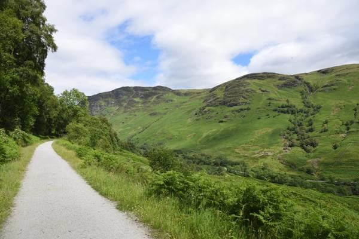

## Killin It

We saw a lot of bikers on the route to Killin. I think many were staying
at the campsite with us and were just doing a day trip. Killin was pretty
close only about 20 kilometers and was kind of a rest day for us after
the two long hill days. The route to Killin was pretty nice except for
the loose gravel coming down the killside into the town. Killin was a
cute little town along a river. The river flowed over some large rocks
and under a stone bridge. There was one pub at the end of the bridge
that we came from and across the bridge was the rest of the town. We
found an inn and took the last available rooms. They might have been
the last rooms in the whole town.

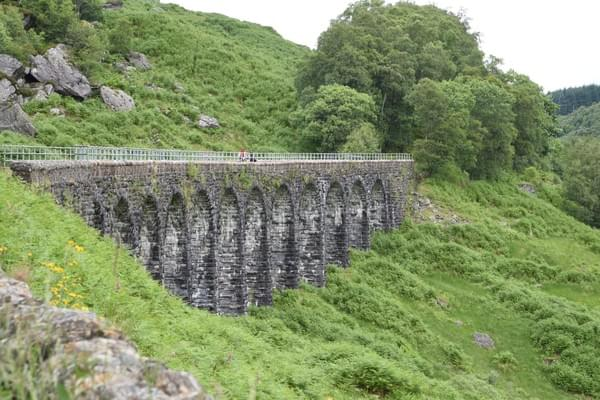

We wandered the town in the afternoon and did some shopping. Vicki and I
bought a bunch of postcards, Wende and Dan bought some sneakers: Wende's
were full of holes from riding in the rain. For some reason they both
wore their worst shoes, maybe they had intended on getting rid of them
the whole time. We made a reservation at the restaurant across from our
B&B. The dinner there was really good. Probably lamb and potatoes. After
dinner we walked back across the bridge to go to the pub where there
was a guitarist playing.

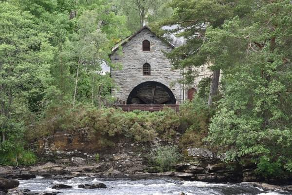

The guitarist was playing older rock songs. We were expecting something
like the Irish trad music. He took some requests. Eventually my mom got
tired and went back to the B&B. Vicki and I stayed even though we knew we
had a very long ride tomorrow. We got a few more drinks. An Irish/Romanian
couple sat with us and taught us how to drink Whiskey (the Irish way)
as well as the difference between Whisky and Whiskey.  Later a guy in
traditional scottish clothes showed up and everyone started dancing and
singing. It was a really fun night and we probably stayed way to late.
Surprisingly, the party was still going on after we left.

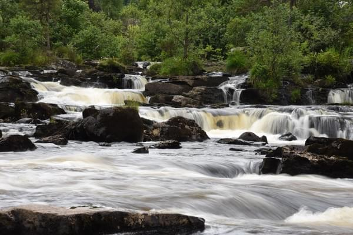

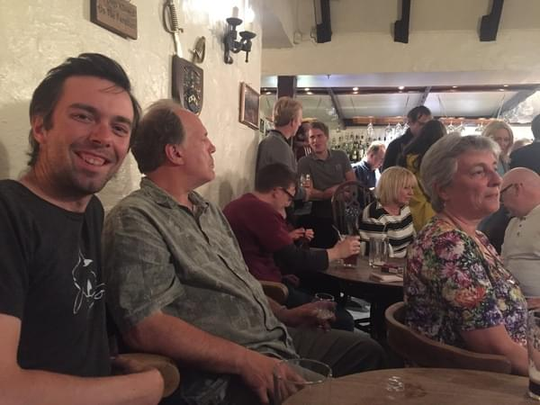

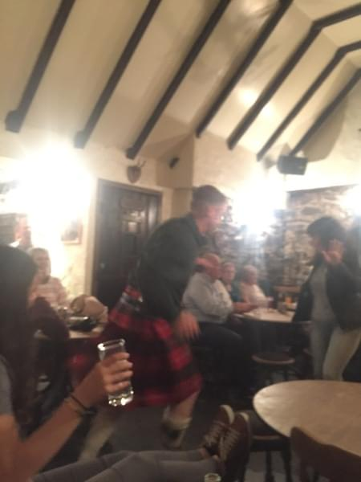
