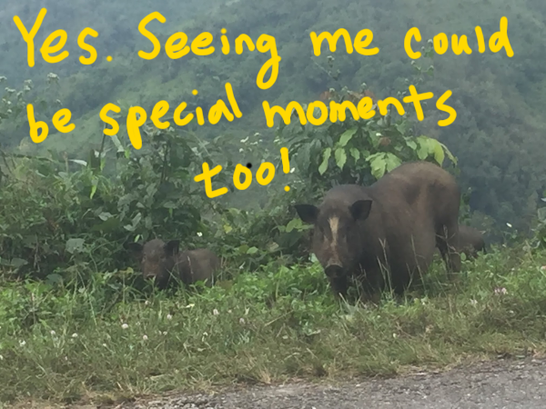

+++
title = "Everyone Should Bike in Laos Once"
date = 2018-08-28T15:39:09-07:00
author = "Vicki"
publishDate = 2018-08-30
featured_image = "/post/laos-is-my-favorite/images/DSC_6016.jpg"
trip_date = "2017-11-30"
categories = [ "vicki talking to herself", "journal" ]
countries = [ "laos" ]
series = [ "Laos" ]
tags = [ "mountains","biking","favorite" ]
draft = true
+++

One of the questions I get asked a lot regarding our trip is "What's your favorite country?"<!--more-->

I find myself going back through time on all the amazing sceneries, beautiful old cities and wonderful attractions all over Europe and New Zealand. However, biking in Laos gave me the most sensational experience and a different look on the world I am in.

## A night on the train to Laos
We started our journey to Laos rather dramatically. It was after a long day and night train (nearly 24 hours) from Surin, Thailand to Nong Khai (the border of Laos). Andrew would definitely say that was the worst train experience he had in his life. We had to transfer from one train to another in the middle of the night. Once we hopped on the train, all seats were taken. The only ones available were next to the toilets. There were cockroaches running around on the wet floor of our seats…(yep) I don't think Andrew slept at all. Luckily, I did slept for a bit. I put up my feet on our luggage and threw a buff scarf over my face. Once we got to the border the next morning, we biked our way to Vientiane (The capital of Laos) on a hot sunny day. 

Our journey started in the busy city of Vientiane, where there are some tourist attractions here and there. But to me, the real Laos was when we left the busy Capitol and were heading north. The ride was about 450km to Luang Prabang. Over the mountains and deep into Laos.

## Seeing a man with a rifle
We were mostly by ourselves following the road into the mountains. As we were cruising along the road, we bumped into a guy walking on the side of the road. He looked like he was just walking to somewhere. But with a rifle casually hanging on his back. I was very nervous. When I passed him, I accidently made an eye contact. Out of desperate panic, I smiled at him. While I prayed to all universe for me not to die here, he smiled back at me. It is a miracle! Having that said. Laos is really safe in my opinion. We were probably just really lucky to run into him.

## I learned to sleep anywhere
When we were in the mountains, finding a place to stay was not hard but self exploring. For instance, I did not know I was capable of falling asleep in a public bathroom-like room. I won't go into details on how not clean the place was. For the two of us it was only $5 for a night. I remember trying real hard not to move since I don't want to touch the wall or expose more areas of my body to the sheets. Despite the jaw dropping situation, we were soon sound asleep after a long day of climbing up the mountains. Now that I think about it, I can't help feeling proud of myself. It's like winning a challenge. I bet you won't be able to stand it.

## Happy moments on the road
While we were zig zagging up the mountains, a lot of truck drivers were cheering for us. One morning while we were descending down a valley, they even lined up and waited for us to pass first. Along the way, there were many small villages. The kids would run along with us or hold out their hands for a high five. They would yell from far away to say hi. I never seen kids so excited and happy to see us. One time, a few kids even gave me a push on my bike while I biked up a steep dirt hill.

Laos has gone through some hard times and a lot of the villages seem to have so little. Yet, people were so friendly and happy to see us. It was dreamlike. I’m glad I was able to see how simple happiness can be sometimes.

The last few days to Luang prabang were hard climbs but very rewarding for our self confidence and ego. Especially given that I have injured myself from falling off my bike (See post <a href="/post/the-day-i-crashed-my-bike">here</a>), but was still able to finish. One of my favorite things about bike touring is reaching the destination you have planned for. It's surreal and often times I still can't believe I was able to make it. And the crazy part is that it didn't seem that hard at all. We were so happy to see Luang Prabang. I don't think the moment would have been as magical if we arrived by bus. Luang Prabang was a charming town full of restaurants and temples. It was a bit unreal given how other areas were like in Laos.

## Embrace special moments in life
Being back home now, I find myself coming back to these precious memories. It reminded me of the adventures, and simplicity of life. Maybe I have learned a little secret. If one day I feel lost in the daily hustle and bustle, then I can always go on an adventure and appreciate life’s special moments - take in what the world has for us. 

## Some photos in Laos.

One of the guesthouse that was not that bad.

Andrew enjoying some local food.

