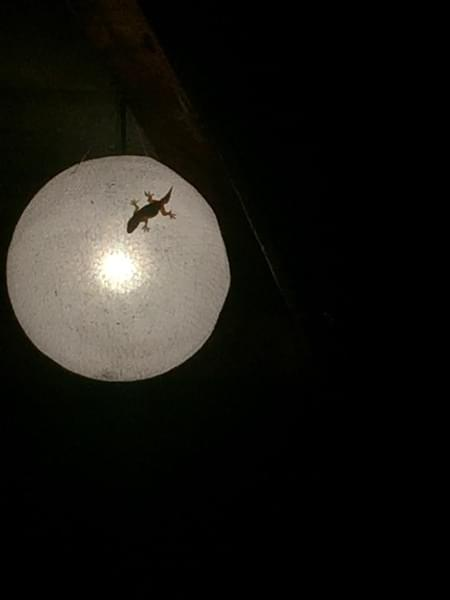

+++
title = "Everyone Should Bike in Laos Once"
date = 2018-08-28T15:39:09-07:00
author = "Vicki"
publishDate = 2018-09-11
featured_image = "/post/laos-is-my-favorite/images/DSC_6016.jpg"
trip_date = "2017-11-30"
categories = [ "vicki talking to herself", "journal" ]
countries = [ "laos" ]
series = [ "Laos" ]
tags = [ "misery" ]
draft = true
+++

One of the questions I get asked a lot regarding our trip is "What's your favorite country?"<!--more-->

I find myself going back through time on all the amazing sceneries, beautiful old cities and wonderful attractions all over Europe and New Zealand. However, biking in Laos gave me the most sensational experience and a different look on the world I am in. 

We started our journey to Laos rather dramatically. It was after a long day and night train (nearly 24hours) from Surin, Thailand to Nong Khai (the border of Laos). Andrew would definently say that was the worst train experience he had in his life. We had to transfer from a train to another in the middle of the night. Once we hopped on the train, all seats were taken. The only ones available were next to the toilets. There were cockroaches running around on the wet floor of our seats…(yep) I don't think Andrew slept at all. Luckily I did slept for a bit. I put up my feet on our luggage and threw a buff scarf over my face. Once we got to the border the next morning, we biked our way to Vientiane (The capitol of Laos) under a hot sunny day. 

Our journey started in the busy city of Vientiane, where there are some tourist attractions here and there. But to me, the real adventure was when we left the busy Capitol and were heading north. The journey was about 450km to Luang prabang. Over the mountains, deep into Laos… 

We were mostly by ourselves following the paved road into the mountains. At one point, we bumped into a guy with a rifle. He was walking along the road. I was very nervous, when I passed him I took a quick look and smiled at him. Probably out of desperate panic…While I preyed to all universe for me not to die here, he smiled back at me in a friendly way. Thank you! Life is still good. 

When we were in the mountains, finding a place to stay was not hard but self exploring. For instance, I did not know I was capable of falling asleep in a public bathroom-like room. For the two of us it was only $5 for a night. I remember trying real hard not to move since I don't want to touch the wall or expose more areas of my body to the sheets. Food wise, there weren't many options. But there were noodles and some Chinese restaurants along the road. 

While we were zig zagging up the mountains, a lot of truck drivers were cheering for us. One morning while we were descending down a valley, they even lined up and waited for us to pass first. Along the way, there were many small villages. The kids would run along with us or hold out their hands for a high five. I never seen kids so excited and happy to see us. One time, a kid even gave me a push on  my bike while I biked up a steep hill. The people in the villages have so little but they were all smiling and waving at us. I am forever grateful to feel this joy. 

The last few days to Luang prabang were hard climbs but very rewarding for self confidences and ego. Especially given that I have injured myself from a fall off my bike but were still able to finish. Luang Prabang itself was beautiful and full of restaurants and temples. It was a bit unreal given how  other areas are like in Laos. 

Being back home now, I find myself coming back to these memories in Laos. It reminded me of the adventures, and simplicity of life. Maybe I have learned a little secret, if one day I am not happy with everything, then I can always go on an adventure with nothing but everything. 

One of the guesthouse that was not that bad. 

Andrew enjoying some local food. 
