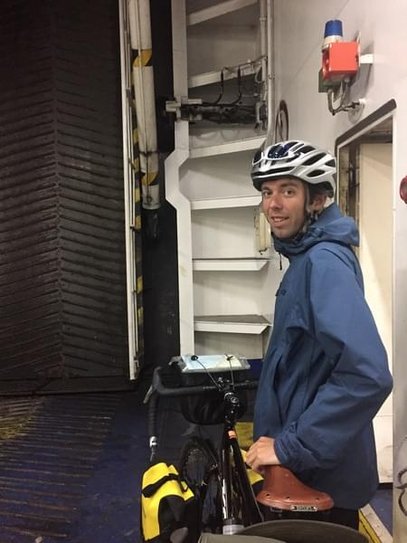
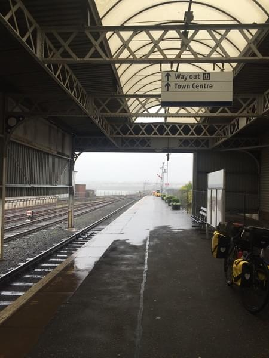
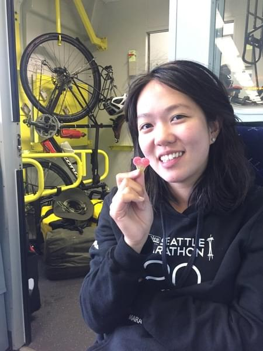
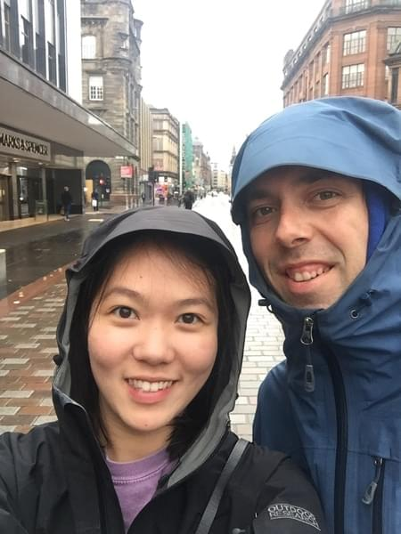
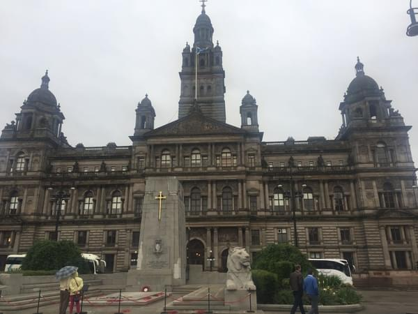
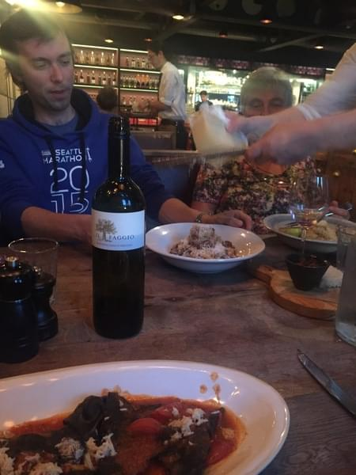

+++
title = "Meet Me in Glasgow"
date = 2018-04-23T21:25:17+12:00
author = "Andrew O'Neill"
publishDate = 2018-04-27
trip_date = 2017-06-27
categories = ["journal"]
countries = ["scotland", "uk"]
series = ["uk", "a lap around scotland with my mom"]
tags = []
+++

While we were traveling in England, we convinced my Mom, Wende, that she
had to join us. We were having too much fun to miss out on.  Actually,
it didn't take much convincing. Anyway, Wende and Dan decided they would
join us for a bike adventure. <!--more-->

## Getting To Glasgow

For us that set a deadline for our trip in Ireland. We now had somewhere
we actually needed to be at a certain time. Fortunately we planned ahead
enough to arrive in Scotland at the same time. We just didn't know what
would happen on our way.

We woke up early on the June 27th to catch a ferry from Belfast to
Cairnryan. The ferry was a little farther than expected and took us longer
than we planned to get there. I started to freak out a little about being
late and not meeting my Mom (who didn't have any way to contact us). On
the last half mile of the road to the ferry my tire was punctured for
the hundredth time. I sent Vicki ahead to secure our spots on the ferry
and hopefully hold them for long enough for me to make it. While running
down the road pushing my 80 pound bike I missed the sign for cars to
turn and accidentally went down the road for trucks. When I got to the
station the security guard was very confused. I told her about the flat
tire and she said that the way to the ferry for pedestrians was back a
bit. I asked if she'd help me lift my bike over the guardrail so I could
cut straight to the terminal. She agreed and then was shocked when she
realized how heavy my bike actually was. After jumping the rail I saw
Vicki and pushed the bike over to the terminal.

We also hadn't realized that getting the bikes on the ferry would require
a ton of paperwork. Much more than when we went to Ireland at least. After
filling out a bunch of forms and paying all the fees we rolled our bikes
on the ferry and locked them in a crew room in the lower area. I got a
bunch of stares for pushing my bike.

The ferry ride was much more pleasant than our previous one. No one felt
any sea sickness and we got there pretty quick as well. After arriving,
we set to fixing the puncture. Then we rode south to Stranraer (the
opposite direction of Glasgow). Of course it was pouring rain and we were
completely soaked. We rode first to the train station to center ourselves,
then went off to find something to eat and warm us up. We settled on a
tea shop and stripped off our wet jackets and had some tea and scones.
It was so nice to sit somewhere dry, but I'm sure the shop wasn't happy
with the puddles we were creating on the floor.  When it was time to go
we headed back to the train station and bought some tickets to Glasgow.

When we got to Glasgow we set off for the Hotel/Apartment. We were really
excited to meet up with my mom. When we arrived at the apartment it was
empty. There were no signs of Wende or Dan anywhere. We had no idea
where they were since we could not contact them. We went back to the
reception to check if they arrived and he said there was a note for us.
It said Wende and Dan had gone to pick up their bikes and they'd meet us
at the apartment later. We took a short walk around the city then went
back and waited until they were back. It was so nice to see them. The
last time we saw them we were dropping off Oscar and preparing for the
journey. We decided to go out for a good dinner to prepare us for the
upcoming challenge of biking around Scotland.

We went to a restaurant started by Jamie Oliver or some famous TV
chef. The food, wine, and company made it an excellent night. After dinner
we walked back to the apartment. Vicki and I were exhausted from our long
day of biking and travelling. Wende and Dan were not tired at all. The
jet lag and excitement from being somewhere new must have given them
some energy because they decided to go out and hit the town. From what I
remember they said they went to a small casino and had a few whiskies. I'm
not sure what time they got back because we were fast asleep.
