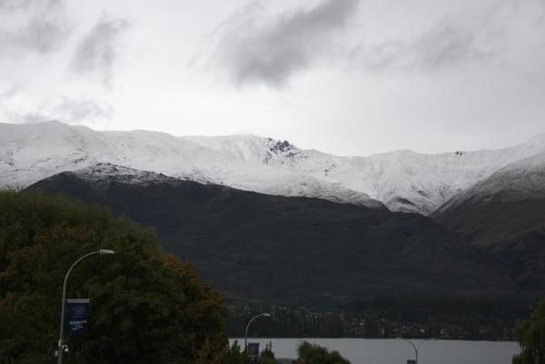
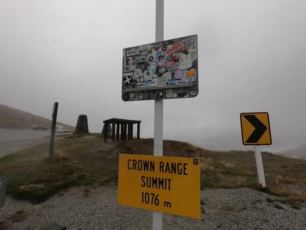
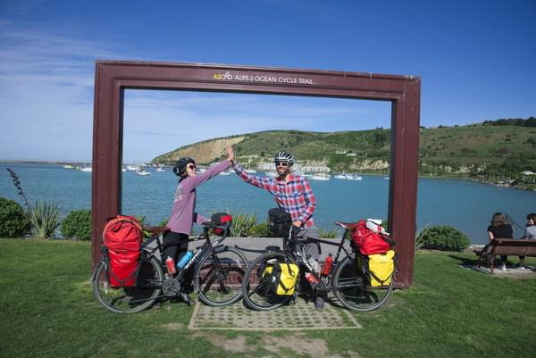

+++
title = "New Zealand: Where you get tired of natural beauty"
date = 2018-04-01T13:18:55+12:00
author = "Vicki"
publishDate = 2018-04-15
trip_date = 2018-04-01
featured_image = "/post/nz-where-you-get-tired-of-natural-beauty/images/DSC_8060.jpg"
categories = ["journal" ,"first times"]
countries = ["new zealand"]
series = ["new zealand"]
tags = ["misery"]
draft = true
+++

New Zealand was not my idea. Now I think about it. Andrew was the one who really wants to go… <!--more-->

### Chapter I: First Time Crying on the Road

Here I am though, in New Zealand. First of all, I did not expect it to be cold, freezing cold. We started from Queenstown in the south Island and are on our way to Mountain Cook. We haven't even got close to Mountain Cook and I already broke down crying. Yes CRYING. For the first time on our trip. 

For those who plan to bike from Queenstown to Wanaka through Crown Range Road. Do not go unless you want to push your bike for 3km. It was our first day in New Zealand and of course we encountered the coldest week in March, where it snowed in the mountains. There are several things that led to me crying: 

1. It was STEEP as frank.
2. It was a busy narrow road: there weren't any shoulders, cars were flying by like crazy. ( I feel like I'm being judged and endangering my life. Not that I care about what people think… okay maybe I do. WHAT EVER)
3. It was raining. Pouring rain. 
4. It was COLD. I was freezing. 

To sum it up: I had to push my bike up the mountains with tons of cars rushing by in pouring cold rain! With no alternative.( I guess I can always give up and yell at Andrew then ditch my bike and walk. )

But when my tears and the rain combined, something magical happened… NOT. 

I just had to continue push my bike up the crazy road and preyed that the cars won't hit me. 

The only good thing is that we can say that we conquered Crown Range Summit (1076m). Andrew was so out of it that he didn't even care about taking a photo up the mountain. He even said " You can punish me however you want. " meaning he admits that this was a dumb idea and I totally deserved to cry. 

Us cold on the Crown Range Summit...

### Chapter II: When you pay for a helicopter, you better get some. 

After a few bad days in the rain and the base of Mountain Cook. We spent some money on a helicopter flight over the Tasman River to the official start of the A2O trail. I don't know if it's because we spent a lot of money or what but everything seems to go right now. 

The beginning of the trail in the valley is absolutely stunning! We rode along the glaciers, mountains and river. After some unreal sceneries, we rode around lake Pukaki. The blue of the glacier water is a whole new level of blue that I have ever seen.

After a gorgeous day of riding, we wild camped along the lake. It's my first wild camp ever. Not sure if I like it but I don’t hate it I guess. Well, I know it's pretty safe, but it's still weird to just trust the place and believe that sleeping here will have no trouble and that it should be a safe and sound night. Turns out we were just fine. As for the logistics, the lake water was so clean that I was able to wash my face and boil some noodles for dinner. Anyway, I am capable of camping in the wild! 

### Chapter III: Alps to Ocean trail and Oamaru

When Andrew suggested us to go to New Zealand. I googled trails to ride in New Zealand. And A2O was one of the recommendations. 300+ Km from Mountain Cook to Oamaru ( a small town along the coast). I must say it's certainly beautiful! 

From the cold glacier mountain to the warm ocean breeze, I feel like we get to see a lot of New Zealand in just 6 days. Most people ride with their mountain bikes and have very little luggage. Yep. I think Andrew and I are crazy on that part for riding the trail on our touring bikes with tons of stuff. But it is totally doable. Expect to push your bike on some of the rough shingle roads. But it's mostly car free and if you are the type that likes to be in the middle of no where. This trail is for you! 

Here's us finishing the trail.

I wish there are more cafes or food along the way, but I guess we are in New Zealand after all. We didn't see a kiwi yet. But saw a little penguin hiding under the stairs of our camp site at Oamaru. 

Oamaru is like the first civilization after Queenstown. We enjoyed the boysenberry ice cream! 

The Whitestone cheese was super good too. 

Here's me having a beer at Scotts Brewery. 

I really enjoyed the past few days in New Zealand. Including the tiring episodes of pushing our bikes...

"It's okay to be scared sometimes, but don't you let it stop you from having fun!" 

Our route in New Zealand. 
