+++
title = "Scotland Part 4: Riding to Pitlochry"
date = 2018-05-27T11:49:55+02:00
author = "Andrew O'Neill"
publishDate = 2018-06-10
featured_image = "/post/scotland-4/images/DSC_2208.jpg"
categories = ["journal"]
countries = ["scotland", "uk"]
series = ["a lap around scotland with my mom"]
tags = ["whisky", "castle", "lake"]
draft = true
+++

The one were Andrew get's a flat, the gang meets a vampire, we visit a
castle, and drink some premium whisky. <!--more-->

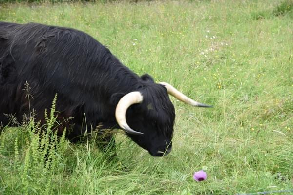

## Passing Through Dull

The next day we began the ride to Pitlochry. Since Wende had made a
non-refundable booking, we decided to push ourselves and make it to
Pitlochry. The first part of the route followed the lake to the east.
The road had lots of rolling hills so we weren't making significant
progress. Coming the opposite way of us seemed to be a classic car
parade. There were many old convertibles and coupes.

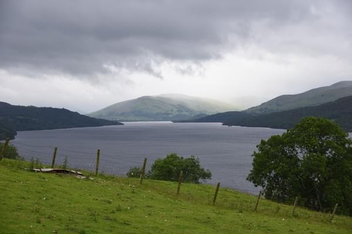

After coming over one of the hills I got a puncture. I told Vicki to catch
my Mom and Dan who were riding in front of us and tell them. I felt like
it was a Top Gear moment, when one of the hosts cars would undoubtedly
break down. Then they'd be left behind to deal with it themself. I patched
the tube and caught up. They had stopped at a shop a few miles ahead and
waited. We continued on to the end of Loch Tay where we stopped for some
lunch. After a quick bite we continued toward Pitlochry.

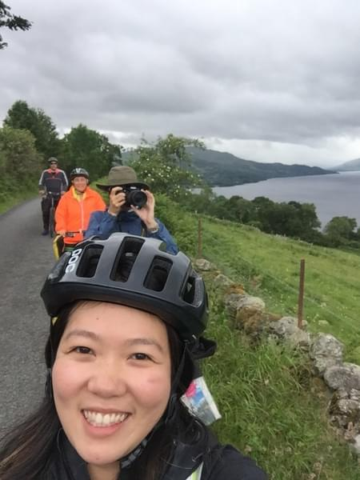

We passed through Dull, sister city to Boring, Oregon. We stopped
at Castle Menzies to use their restrooms and get an American History
lecture. Then rode through Aberfeldy without stopping at the distillery
(I can't believe it either). We finally arrived in Pitlochry right
before it started to get dark. As we rode through town it felt a like
a ghost town. I expected much more people to be out and about, since it
was around 5PM. Our hotel was in the back of town on a hill. We stored
our bikes and immediately went for the hot showers.

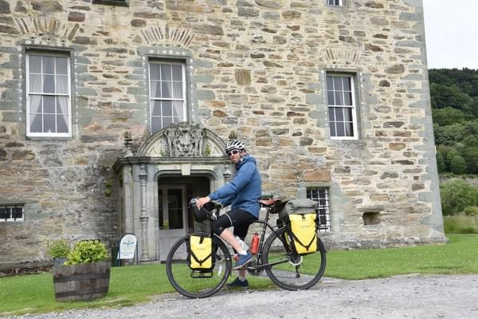

The man managing the hotel was really charming. He had some interesting
stories to tell as well. He was originally from Romania and apparently
lived or worked (I forget) near Count Dracula's Castle.  His accent and
the precision which he chose his words made Vicki and I wonder exactly
how close he was to Dracula's castle.

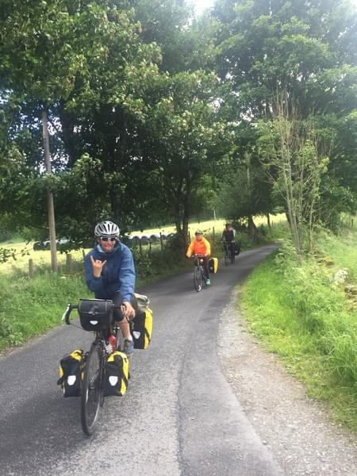

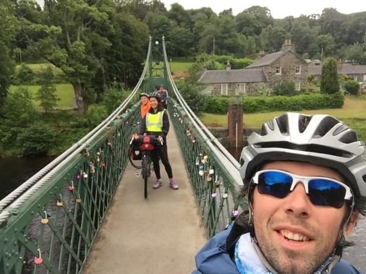

## A Day Without Baggage

The next day we ditched the bags and did some short rides to the nearby
destinations. First up was Blair Castle. The castle is really bright,
white. There was a bagpiper that would play every 30 minutes or so
and march from one door at the end of the castle to the main door at
the center. The inside of the castle had tons of treasure and fancy
stuff you'd expect in a castle. The rooms I remember most clearly are
the entrance with all the guns, shields, swords, and spears, the room
with all the hunting trophies (where trophy means animal head), and the
ballroom where we put on funny costumes meant for children.

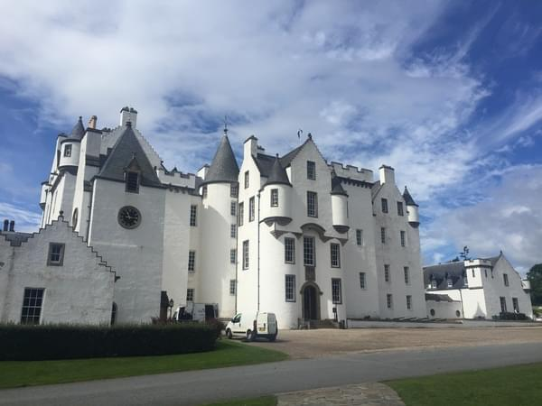

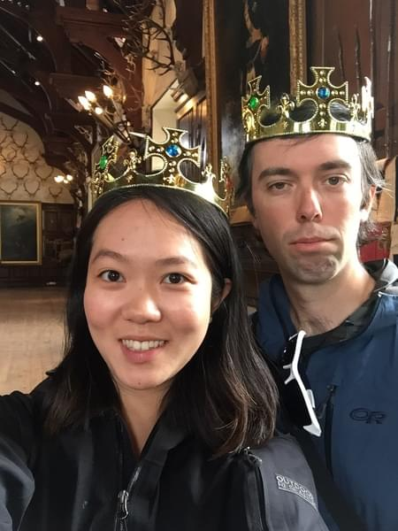

We had some tea in their cafe then went and explored the gardens. Vicki
and I played on some playground equipment before joining Wende and Dan
in the Hercules Garden. The garden is really beautiful. There was a swan
family in the lake and many interesting statues. After we had walked
the gardens we hit the road.

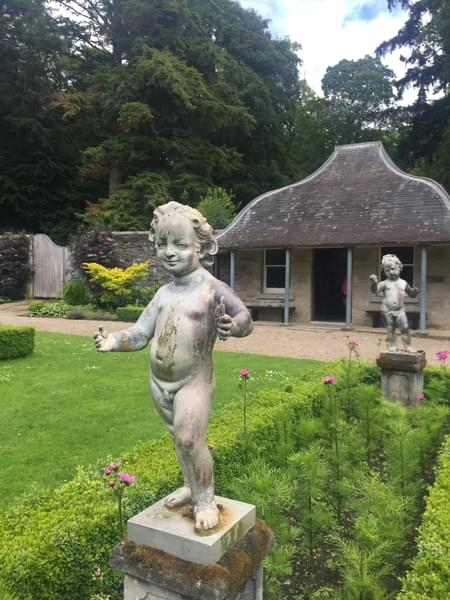

Our next destination was Edradour distillery. The route was back through
Pitlochry, which was buzzing, and then down the road past another
distillery. We then took a right and were greeted by a really long hill
up to the Edradour distillery. Vicki and I arrived first and ran in and
bought tickets for the last tour. Dan and Wende got there just in time
to start the tour.

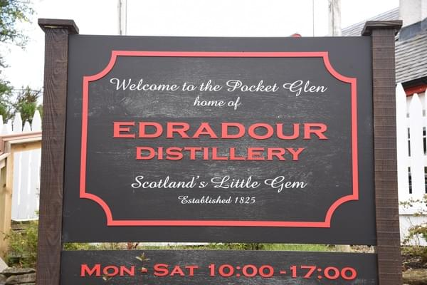

Edradour is special as it is the smallest traditional distillery. Every
barrel of whisky they made was unique. Unlike many distilleries that do
everything to maintain the same color and flavor, Edradour prided itself
on it's differences. We took a tour of the distillery which included 2
whisky samplings and a whisky glass to take home (another glass for Dan
to carry).

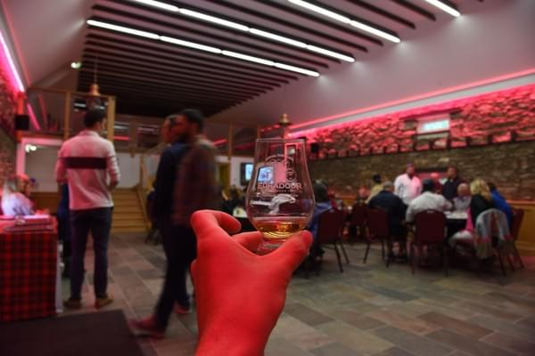

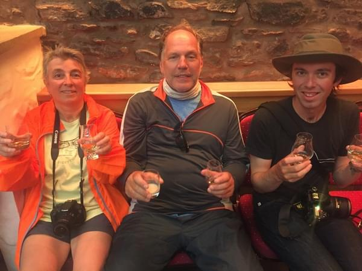

In their storehouse, we saw all the barrels they were making as well
as some other barrels that they were collecting. One special barrel was
worth a couple million.  They kept it near the door so if a fire broke
out it would be the first barrel rescued. After the store house they took
us to their distillers and mashers and whisky bean thingies. I'll need
to have some Edradour to remember the names of everything. Dan bought
a bottle of their "Baileys".

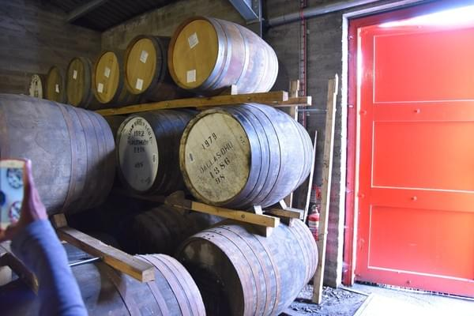

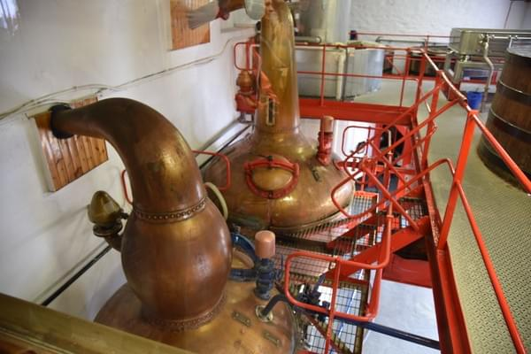

We decided to try a different route back to our hotel which turned out
to be really nice (the whisky might have helped that opinion). It was
a long winding road that came from the backside of the town past farms
and right up to our hotel. Thankfully it was all downhill. At the hotel
we polished off Dan's recent purchase with our new whisky glasses then
went out to dinner. During our meal, a scottish marching band passed by
and everyone flooded the streets to watch. Since we didn't have too much
time left to travel and wanted to go the the Isle of Skye and the Harry
Potter train, we decided to take a train the next morning for Inverness.
