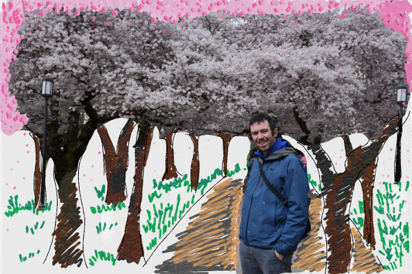
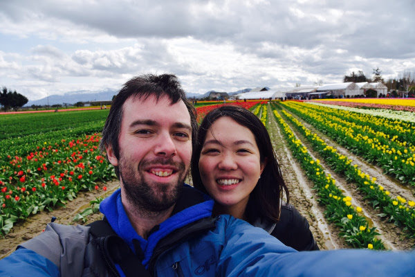
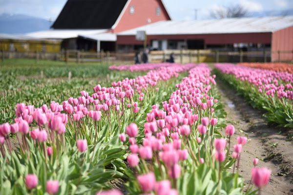

+++
description = ""
date = "2017-04-22T12:27:37-07:00"
title = "Millions of Flowers"
author = "Vicki"
featured_image = "/post/second-post/images/tulip2.JPG"
draft = true
+++

Time is flying...minus the at work part. This post will be about the
beautiful flowers from Seattle! <!--more-->

After moving to Seattle I have been holding a grudge against students from
University of Washington. They have it too good- gorgeous campus, yummy asian
food, awesome city, pretty hills, pretty Landscape, and even their very own
cherry blossoms!

Here is a photo of Andrew alone with the cherry blossoms. 

Also turns out you don't need to go to Holland for tulips. We have it here in
Skagit Valley. But we will still go to Holland soon.

