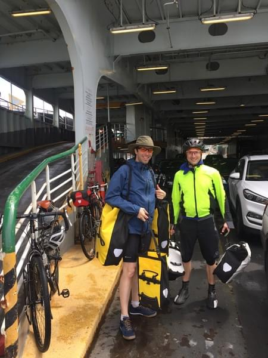
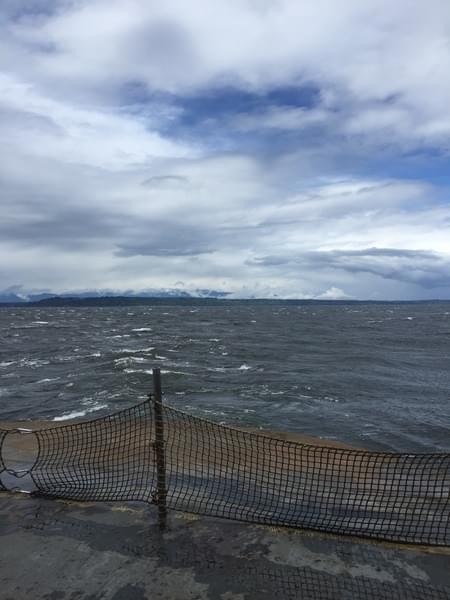
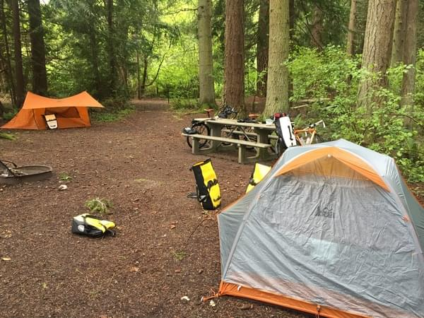
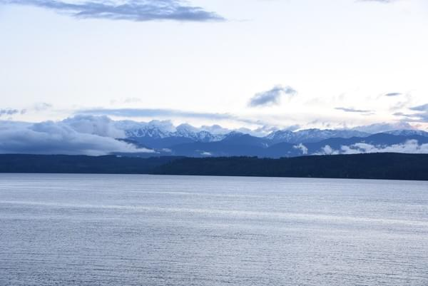
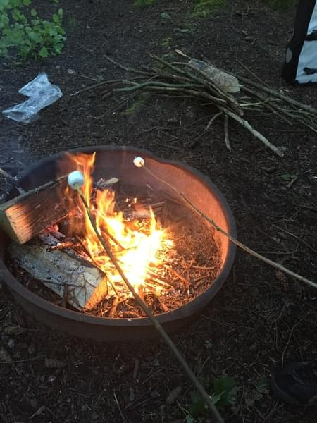
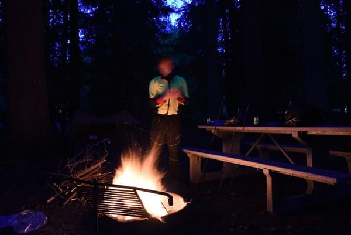
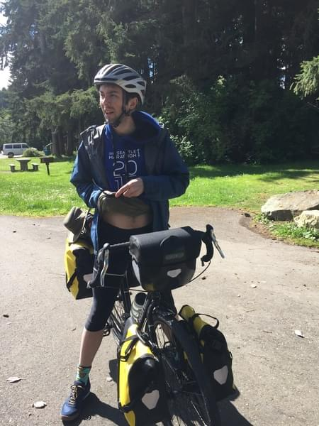
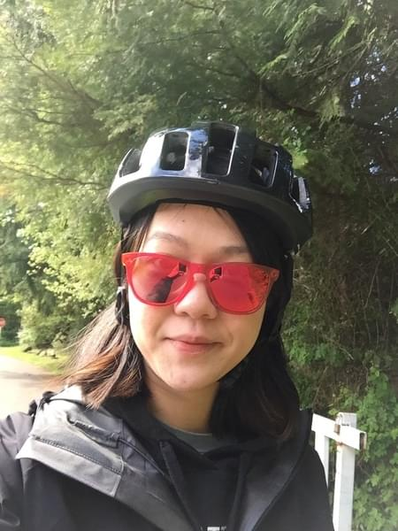

+++
title = "Test Ride"
date = 2018-02-25T21:02:53+08:00
publishDate = 2018-02-27
trip_date = 2017-05-12
author = "Andrew O'Neill"
featured_image = "/post/test-ride/images/DSC_0445.jpg"
categories = [ "journal" ]
countries = [ "USA" ]
series = [ "Pre Not Quite Vacation" ]
tags = [ "Turner", "Seattle", "Camping", "misery" ]
+++

Vicki and I want to test out our new bikes and gear so we call up
Turner and ask if he wants to go camping.  He agrees and we decide to
meet at a coffee shop in Greenlake at 9AM.  Vicki and I have only
ridden our bikes a handful of times.  Vicki, maybe only from the store
to our apartment (less than a mile), and me only to work once or
twice.  We want to make this excursion feel authentic to our journey
so we pack all the stuff we plan to take in our bags.  Vicki, didn't
bring everything.  She left out some clothes and other things.  I
bring almost everything I can think of including about 20 pounds of
textbooks.

We are running late, and still packing at 9 when we promised Turner
we'd meet him.  We take our bikes downstairs and start loading our
bags on to them.  I can barely keep my bike steady as I load the front
panniers.  Then, with Vicki watching, and pleading with me to leave
the textbooks behind I step over the top-tube and put all my weight
into the pedal.  It actually moves much easier than I expect, but then
the bike starts wobbling horribly.  I wrestle with the handle bars to
keep the bike steady, but I know I won't be able to ride 30 miles like
this.  I stop after about 20 feet and look back.  Vicki says I told
you so and I run back upstairs to drop some textbooks.

We end up meeting Turner closer to 10.  It's raining and cold.  Vicki
and I grab a coffee and breakfast because we haven't even had time to
eat yet.  We ride north to the ferry.  We get there just in time and
Turner buys our tickets.  After storing our bikes we go up to the main
deck and start eating all the snacks we brought.  The ferry arrives at
the other side and we ride along the highway to the campsite.  Cars
are not nice in this area.  Especially the big trucks.  A few pass us
within a few feet.  I think we're going to die.  I say my favorite
bike prayer a few times.  "Please don't kill me.  Please don't kill
me.  Please don't kill me."  We eventually get to the campsite.  My
knees are killing me.  I start to feel like I won't be able to do the
trip.  If this gets worse or continues every day I'll definitely give
up.

At the campsite, we select a pitch in the back.  Vicki runs to the
bathroom.  Turner starts collecting sticks for a fire and I unpack
some of my stuff.  As Turner and I are busy around the site, An older
guy approaches with the world's grossest dog.  I think it's missing an
eye and may have been brought back from the dead.  The first thing he
says is, "My dog wants to kill you".  I am thinking what the fuck, but
only say "What?".  I look at Turner but he didn't seem to hear him.
Apparently his dog hates people who gather kindling.  The guy believes
we're committing a felony by collecting sticks from around the site.
Turner and I laugh nervously.  He says he'll sell us firewood for a
buck.  I give him a buck hoping he'll leave us alone.  Turner goes to
get the wood with him.  Turner comes back with wood a few minutes
later.  Vicki has also returned.  Turner tells us he had a pickup
truck full of empty beer cans and a drunk friend passed out in the
cab.  Turner says the guy was pretending he couldn't find the wood
while shuffling through the junk in the truck.  We're both pretty
sketched out by this guy.

A little later the ranger comes by.  He tells us there is a "cheaper"
pitch for bikes, and it's more secluded.  We decide to check it out
and it is much better.  We decide we should be as far from the dog
walker as possible.  After setting up our camp at the bike pitch, we
decide to ride to the town 6 miles away to grab some food and beer.
Riding without all the bags is much easier but I still question the
fitness of my knee.  We eat some greasy food and throw back a few
beers.  It rains while we're inside but when we finish it has stopped.
We ride back to the camp site.  We buy more beer from the gas station
across from the campsite.  We have a beer when we're back and decide
to go see the sunset from the beach area.  Turner starts a fire after
the sunset and we all have another beer.  I play with the camera for a
bit while we sit near the fire and chat.  The first thing that kicks
in is sleepiness.  We decide to hit the sack.

I fall asleep quickly from the beer and tiring ride but woke up pretty
soon after.  I hear a truck driving around and stopping, doors slam,
foot steps, door opens, car moves, repeat.  I'm sure it's getting
closer.  Vicki notices I'm freaking out.  I'm thinking we're all about
to be murdered.  Probably Turner first.  Since he's closest to the
entrance from the road.  But what if they stop near the circle then
they might spot us first.  It's probably the dog's owner and his drunk
friend.  They are coming to get us for the wood.  Maybe Vicki and I
can escape.  Will they open the tent first and check if we're in it or
just shoot at the tent?  They didn't shoot at other tents they'll
definitely check first. Do they have guns? Maybe they have knives or
something more sinister.  Should I get out of the tent before they
come.  Getting out of a tent is not easy.  Fuck, we're all dead.
We're gonna die.  We won't even get to go on our trip because we'll be
murdered here.

The truck drives away.  We're not murdered.  I'm still paranoid and
every noise sets my brain racing with horror movie scenes.  In the
morning, we learn Turner was totally passed out and didn't even notice
anything was happening.  Vicki thinks I'm crazy, but I'm so thankful
we're not all dead.  Turner makes some coffee and we boil some eggs
and bacon.  Because we survived the night, this is the best breakfast
ever.  We pack our stuff to go.  It seems like all our stuff works.  I
start to feel like we can do this for the next 365+ days.  Turner
finishes first and goes to play with his drone.  We take forever to
repack everything and by the time we finish and meet him he's done and
packing the drone up.  Vicki takes a few pictures and we head back to
Seattle.

It rains.  We get wet.  The ride back to Seattle seems way harder than
the ride to the campsite.  After the ferry we have two very big hills
to climb.  I lose all the confidence I had gained that morning.  I
don't think we'll be able to do this trip.  I'm gonna die if we have
to go up a mountain.  I'm barely able to manage this hill.  Vicki
seems to be having an equally hard time.  Turner is fine as usual.  We
eventually get back to the intercity bike path, and have to part ways.
We say bye to Turner.  It'll be the last time we see him until we come
back.  We ride the rest of the way home.

Or at least we try to.  My tire pops after crossing the Fremont
bridge.  I have the tools to fix this.  At home.  Uuuugggghhhh.  Vicki
and I decide I should ride her bike back to the apartment and get the
tools.  Riding her bike is super painful on my knee.  Everything is
really scrunched up making it hard to pedal.  It takes forever to get
there.  Finally, I return with patch kit and pump.  I try to patch the
tire.  It fails.  I try to patch the tire again.  It fails again.  I
give up, throw the tube away and put in a new tube.  We ride home.

There is so much more stuff we need to pack or throw away before we
leave Wednesday.  So we go get burgers and put it off for later.