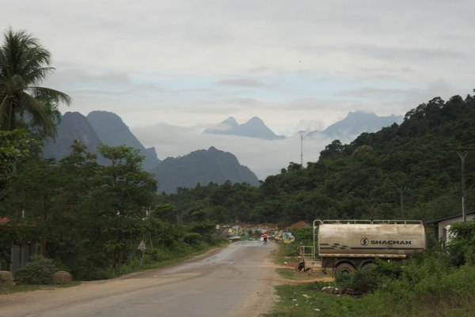
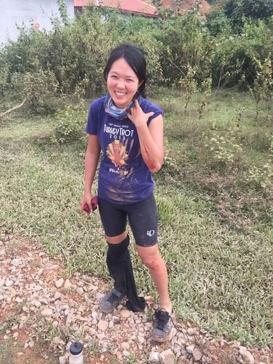
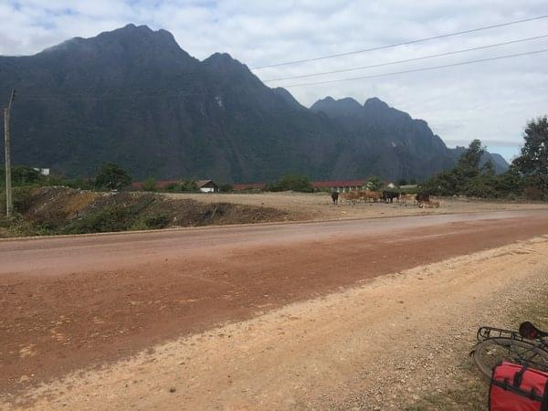
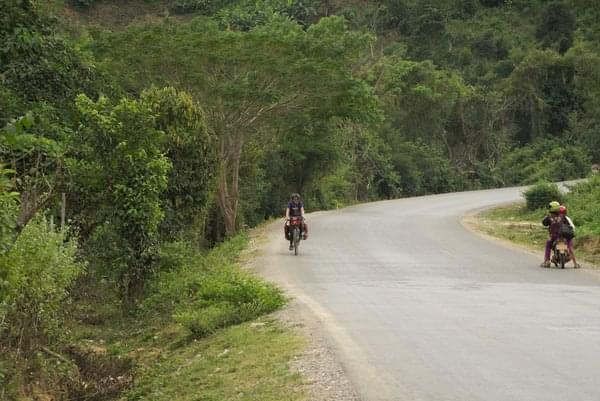
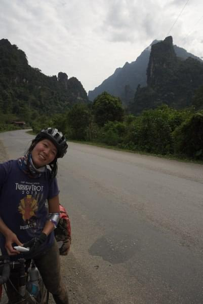

+++
date = "2017-11-24T18:56:40-08:00" #test
title = "The day I crashed my bike"
author = "Vicki"
featured_image = "/post/the-day-i-crashed-my-bike/images/IMG_5181.jpg"
publishdate = "2018-03-17"
trip_date = "2017-11-24"
categories = [ "vicki talking to herself" ]
countries = [ "laos" ]
series = [ "Laos" ]
tags = [ "misery" ]
+++

I crashed my bike on a Friday. It was the day we were riding out of Vang Vieng and starting our 1,500m+ climb over the "mountains" to Luang Prabang in Laos. <!--more-->

It was the hardest and most deserted route that we have planned so far. And based on Murphy's law, of course Andrew and I would both crash our bike right in the beginning of our 3 day climb over the mountains…

It all happened really fast. I thought I would have time to scream or wobble as I imagined when one falls off their bike. The road was slippery and muddy due to some constructions going on near by. My bike slipped and just like that I was on the ground. I quickly got up and moved to the shoulder. A motorcyclist stopped by and checked on me. I gave him a thumbs up. 

I don't know why I am smiling like I won a metal or something… 

The guilty road that did all this...

Apparently Andrew fell off as well when he heard me falling… Luckily he wasn't hurt. My wound was pretty bad. I scraped my left elbow and left knee. We washed it with our drinking water and tried using the Band-Aids. My elbow's wound was too big so I used a tampon pad. It really helped covered my wound and stopped the bleeding. I thought about heading back to Vang Vieng but then decided I'm a badass and can still ride on. 

The next few days were absolutely HARD! I gave up on hoping to see a down hill and just accepted that my fate would be climbing up these hills forever. My knee injury was pretty painful, I feel like I was ripping apart the freshly grown scab every time I peddled. There was also absolutely zero pharmacy or drug stores in the mountains. But there were kids cheering for me. A boy pointed at my elbow and gave me a thumbs up. 

Looking back, I'm glad I was able to challenge myself in situations like that. I think life is fun in that way as well. May we all have the wit to laugh at life's imperfection and climb out of our own miseries physically and mentally. 

P.S. I bet Andrew would have cried and wanted to go home if it was him. 
