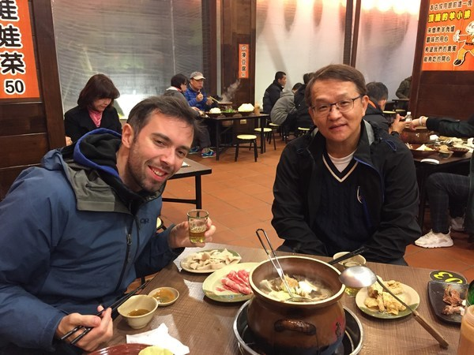

+++
title = "The days where the four of us had absolutely nothing to do"
date = 2018-03-26T17:06:53+13:00
author = "Vicki"
publishDate = 2018-03-26
trip_date = 2018-03-02
featured_image = "/post/the-four-of-us-had-absolutely-nothing-to-do/images/DSC_6882.jpg"
categories = ["vicki talking to herself"]
countries = ["Taiwan"]
series = []
tags = []
+++
I thought forever vacation was already a dream come true. Days on our bikes where we simply ride on and lose count of days.
<!--more-->

But there is something even bigger! For me, it was spending time with my parents for two whole months. I left home (Taiwan) and went to college in the United States when I was 18. Since then, we only get to see each other once a year and for maybe only a week or two. After I started to work, it was even harder to meet up and simply hang out. I almost forgot how it feels to be their kid. 

This time it was entirely different. I feel like I cheated time, and once again was able to relive the moments  of my childhood memories. When I left home and went to the United States for college, I didn't think about "Hey you are really leaving home, and you won't be able to spend time with them or stay with them for long periods of times. Oh and 10 years down the road, you would be really missing those times and wished you had cherished it a bit more…" 

This year though: I am jobless + Andrew is jobless + My Mom just retired + My Dad is free = 2 months hanging out in Taiwan day and night! It was the four of us against the world.

Here's what us against the world looks like...(millions of selfies)

At first, I was worried that my parents will get tired of us. Since their adult kid is unemployed and having too much fun. Turns out, I think they understand that this is a once in a life time opportunity. During those two months in Jan and Feb. The four of us would have breakfast, lunch and dinner together everyday. I can not express how happy and blessed I am. 

Us eating lamb hot pots! 

Us being cute! 

 

Us at the super bowl in Taiwan. Shots with my Dad at 7am in the morning! 

Life is funny. When we were young, our parents were our home, our shelter. They seem to know everything. But when we get a bit older, we think we know better than our parents and are all grown up. Time flies, we then realized being a kid is one of the happiest moments of our lives. Either way, I think we will always be kids to our parents.

Yep. I am so spoiled and my Mom did complain about how short the last two months were. Maybe I'll move back with them.  

