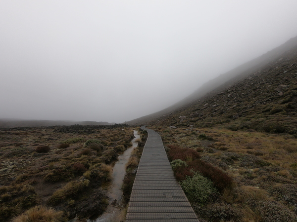

+++
title = "Things you can check off your bucket list with New Zealand"
date = 2018-04-24T14:22:46+12:00
author = "Vicki"
publishDate = 2018-05-08
trip_date = 2018-04-19
featured_image = "/post/tongariro-new-zealand/images/GOPR0487.JPG"
categories = []
countries = []
series = []
tags = []
draft = true
+++
Try not to get blown off the mountain. ✔  
Swim with dolphins. ✔ 
<!--more-->

Never thought I get to check those off. 
## New Zealand's best single day hike

One of our big plans for New Zealand is hiking the Tongariro Alpine Crossing - a 20km hike between Mt Tongariro and Mt Ngauruhoe (Mount Doom). It is famous for its unique volcanic landscapes and cultural importance (peaks and rivers for local Maori). 

Andrew was really hyped up about this hike, since he did some research and the hike is probably one of those must hike before you die kind of trails. (I'll change it to must hike maybe when sunny and clear so you can see the mountain… and not die kind of trails…) Anyway, he was pretty determined to do it even with the rainy forecast. In addition, the people at the lodge highly recommended it and said that the rain and fog will add a mysterious/magical vive to the journey. And that we should totally do it. 

So we (including our friend Sarah) totally did it. And it was in cold rain, gale wind, and the mountains couldn't be any foggier! 

### Lean low and just go

The start of our hike was alright, couldn't see much but the wind was calm and nothing crazy was going on. According to the beautiful pictures taken by others during their sunny days, we should have seen Mt Doom right in front of us the whole time. I was hoping the clouds would disappear at this point. 

Once we started the real climb up the mountains, it started to rain. We were like okay, we knew it was going to rain, so what! Then it got steeper and very cold. (Andrew and I were wearing jeans like a Champ.) The final climb up the summit, was wind blowing at its full blast. 

Both sides were cliffs. 

The wind was trying to kill us. (by blowing us into the crater)

A girl broke down crying.

Andrew was wearing my extra socks over his frozen gloves. 

We were hovering down and sort of crawling so the wind won't blow us away.

### So here we are, at the summit. 

Yeah, that's pretty much what Tongariro Crossing looks like on a foggy mysterious day.

The spirts must have heard us. As we slide down the mountain, the fog finally started to clear away and we were able to see the thermal pools. 

To sum it up, the three of us decided to do a reunion for the hike on a day with clear blue sky and heating sun! 

## Hot Water Beach 

Hot Water Beach is on the must do lists when visiting Coromandel (North Island). We heard that hot water will be bubbling through the golden sand. We were joking around and saying that it will be like sitting in a cold puddle instead. (Jinx it.) And I thought it will be like Onsen. We visited the beach at the recommend 2 hours each side of low tide. Maybe we should have gotten there a bit earlier or not play with dolphins so long… by the time we dug a pool for ourselves, it was cold water. 

But yes I said DOLPHINS. When we arrived at the hot water beach, the first thing we saw were dolphins swimming. Not just one dolphin but like 6 or 7! People were so close to them, it looked like they could touch them if they wanted. I immediately ran/swim toward the dolphins. 

It was insane. Seeing these beautiful creatures swimming close by. Spellbinding. Then I got a bit scared, since I realized I don't know anything about dolphins. Will they charge at me by accident or thought I was a fish and bite me? Or maybe they are sharks… plus they seem to be like mermaids seducing us further and further away from shore. I am not very good at swimming in big waves. So I swam back and are finally ready to dug my cool puddle.

It was the best beach I ever visited. 

Here's me being optimistic. 

